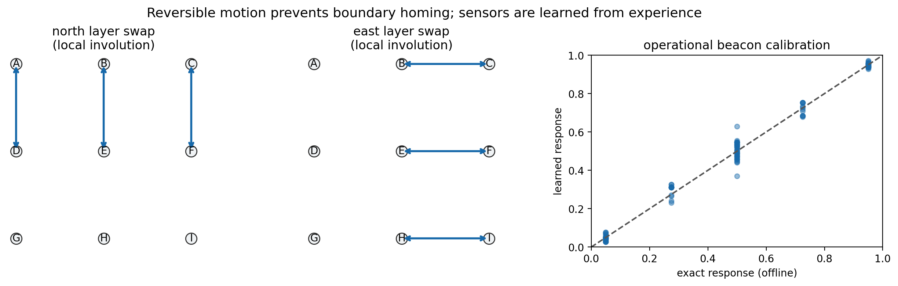
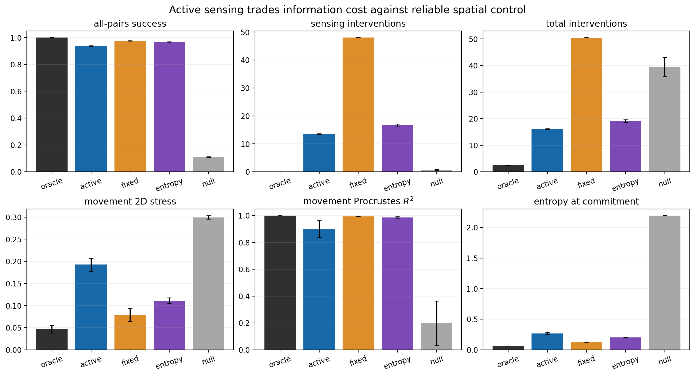
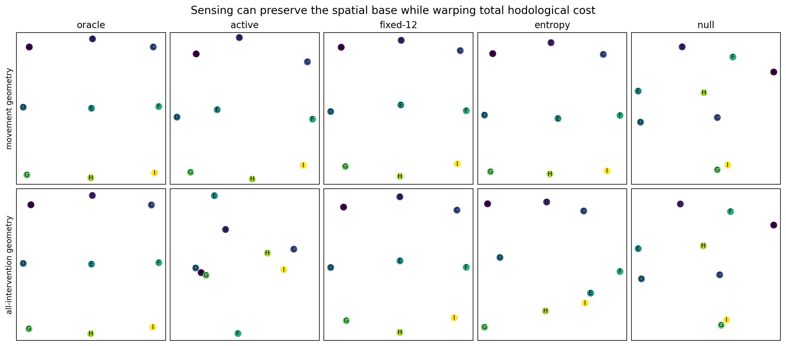
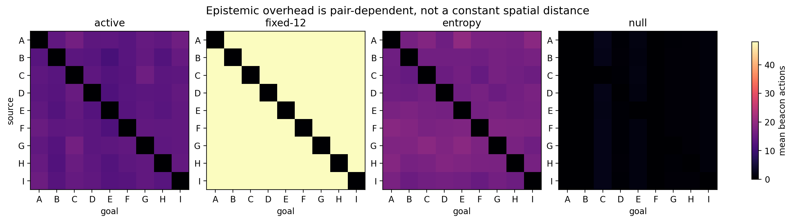
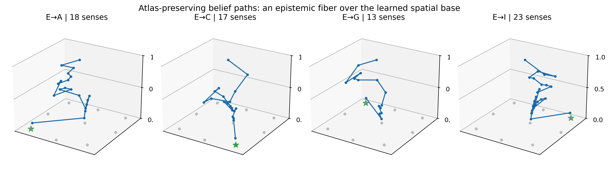

# Active Construction of a Predictive Spatial Atlas

## Status

This study implements the next research step proposed in
`PREDICTIVE_ATLAS.md`: sensing, movement, and terminal commitment now compete
as interventions with the same unit cost. The agent is no longer forced to pay
for a 48-observation scan. It chooses which weak beacon to sample, whether to
move, and when to commit.

The project also makes a second conceptual advance. Open-boundary translations
allowed an unknown state to be pushed repeatedly against a wall, letting a
blind agent reach some goals without localizing. The corrected environment
uses **local random-unitary layer swaps**. These actions preserve uncertainty
and still generate the same optimized two-dimensional shortest-path geometry.
They are coherent quantum channels on superpositions rather than
measure-and-prepare movement.

The best atlas-preserving active controller achieves, across three production
seeds,

- all-pairs success (0.965\pm0.004);
- (16.63\pm0.53) sensing interventions;
- (19.12\pm0.53) total interventions;
- movement 2D stress (0.111\pm0.006);
- exact movement-cost correlation (0.929\pm0.012);
- coordinate Procrustes (R^2=0.987\pm0.004).

The matched fixed-scan controller achieves (0.976\pm0.002) success but uses
48 sensors and (50.49\pm0.02) total interventions. Active sensing therefore
reduces total intervention cost by 62.1% for a 1.1 percentage-point success
loss.

A more aggressively goal-relative value-of-information controller uses only
(13.54\pm0.10) sensors and (16.12\pm0.11) total interventions, but its
success falls to (0.938\pm0.002) and movement stress rises to
(0.193\pm0.015). This is scientifically informative: a state sufficient for
the next decision need not preserve the global metric relations needed for a
shared spatial atlas.

## 1. Research question

The fixed predictive atlas answered “where am I?” before every journey by
collecting twelve cycles of four weak probes. That method removed an exact
online place label, but sensing was not itself goal directed. Every task paid
48 interventions whether its decision was obvious or subtle.

The active question is:

> Can the agent learn when additional place information is worth its cost, and
> can adaptive sensing preserve a common two-dimensional movement geometry?

This requires three prices to live in one objective:

\[
c_{\rm sense}=c_{\rm move}=c_{\rm commit}=1.
\]

Equal price does not imply equal value. A sensor is useful only if its possible
outcomes change what the agent should do or reduce the chance of a false
commitment. A movement can simultaneously alter position and, in a general
partially observed problem, provide information. A commitment ends the episode
and exposes whether the goal was actually achieved.

## 2. The boundary-homing failure

### 2.1 What the first active pilot found

The first implementation placed active control in the earlier open grid. It
began from a uniform belief and used a one-step uncertainty-penalized rollout.
Unexpectedly, the place-independent null sensor obtained perfect navigation in
one pilot while using no sensing.

This was not simulator leakage. Open-boundary translations are many-to-one at
the distribution level. Repeatedly attempting “north” drives every possible
vertical coordinate toward the top boundary. Repeating “west” then drives
every possible horizontal coordinate toward the left boundary. The controller
can therefore synchronize an unknown ensemble at a corner and commit without
ever learning the source.

Such a policy is rational for an individual goal. It is fatal to all-pairs
geometry because behavior becomes nearly source independent. If every source
is deliberately erased before goal pursuit, pairwise source–goal difficulty no
longer measures spatial separation.

### 2.2 Scientific correction rather than hyperparameter tuning

Increasing the information penalty would force sensing but would hide the
structural loophole. The environment was instead redesigned so blind actions
cannot reduce a uniform prior. This is an inverse-design constraint:

\[
P_a\mathbf 1=\mathbf 1,
\qquad
\mathbf 1^\top P_a=\mathbf 1^\top.
\]

Every movement transition is doubly stochastic. Hence the uniform belief is
invariant under movement,

\[
b_{\rm unif}P_a=b_{\rm unif}.
\]

Without informative beacon outcomes, action alone cannot manufacture a place
posterior. The null condition returns to (1/9) success, as it should.

This failure and correction are part of the result. They show that the
emergence of an atlas depends not just on having weak sensors, but on excluding
cheap uncertainty-erasing dynamics.

## 3. Reversible quantum movement

### 3.1 Local layer swaps

On the concealed (3\times3) arrangement, “north” swaps the top and middle
rows while leaving the bottom row fixed. “South” swaps the middle and bottom
rows. East and west analogously swap adjacent column layers. Each is an
involution,

\[
U_a^2=I,
\qquad
U_a^\dagger U_a=I.
\]

The actions are local edge-layer exchanges rather than global translations.
Together they generate the full grid connectivity. Diagonal actions compose
one vertical and one horizontal layer swap.

### 3.2 Random-unitary instruments

For axial actions the unitary is applied deterministically. For a diagonal
action, success applies (U_a) with (p_d=0.715) and failure applies the
identity:

\[
M^{(a)}_0=\sqrt{p_a}\,U_a,
\qquad
M^{(a)}_1=\sqrt{1-p_a}\,I.
\]

Completeness follows from unitarity:

\[
M_0^{(a)\dagger}M_0^{(a)}+
M_1^{(a)\dagger}M_1^{(a)}
=p_aI+(1-p_a)I=I.
\]

Unlike the previous source-resolved movement Kraus family, these channels do
not measure which site was occupied. Conditional on the reported outcome they
map a coherent superposition coherently by either (U_a) or (I). The active
study therefore moves out of the explicitly entanglement-breaking corner of
the earlier construction, although the beacons remain diagonal and QND.

### 3.3 Exact geometry is retained

Although the action semantics have changed, their generated site graph has the
same stochastic-shortest-path costs as the optimized open grid. Axial adjacent
layer crossings cost 1 and diagonal crossings cost (1/p_d\simeq\sqrt2).
The exact matrix therefore retains 2D stress 0.0365 and concealed-coordinate
Procrustes (R^2=1).

The key separation is now clean:

- movement preserves the designed low-dimensional geometry;
- movement cannot localize a uniform prior;
- beacon information is necessary for source-sensitive navigation.



## 4. Self-calibrating operational models

### 4.1 Beacon likelihoods

For each verified landmark (s) and beacon (b), 200 survey trials estimate

\[
\widehat O_b(o\mid s)=
\widehat P(O=o\mid S=s,B=b).
\]

A symmetric pseudocount of (1/2) regularizes each binary distribution. The
sharp landmark probe occurs after the beacon and verifies the chart label; its
outcome is not an online controller input. The learned response-table mean
absolute error against the privileged exact probabilities is
(0.0233\pm0.0057).

After beacon outcome (o), the place belief updates as

\[
b'(s)=
\frac{b(s)\widehat O_b(o\mid s)}
{\sum_jb(j)\widehat O_b(o\mid j)}.
\]

### 4.2 Movement model

As before, landmark-anchored surveys estimate

\[
\widehat T_a(o,s'\mid s).
\]

The production transition total-variation error is
(0.0220\pm0.0026). The learned kernel supplies both stochastic-shortest-path
values and outcome-conditioned filtering:

\[
b'(s')=
\frac{\sum_s b(s)\widehat T_a(o,s'\mid s)}
{\sum_{j,s}b(s)\widehat T_a(o,j\mid s)}.
\]

The online controller uses only the two empirically calibrated tables. Exact
fields, exact transitions, coordinates, Kraus operators, density matrices, and
the current landmark remain withheld.

## 5. Two meanings of useful information

The experiment deliberately compares two active objectives. Their difference
connects two notions already distinguished in `VISION.md`: predictive state
and pragmatic, goal-relative state.

### 5.1 Goal-relative policy partitions

For goal (g), define the optimal fully localized next decision

\[
d_g(s)=
\begin{cases}
\text{commit},&s=g,\\
\arg\min_a Q_g(s,a),&s\ne g.
\end{cases}
\]

The current place belief induces a belief over decisions,

\[
m_g(d\mid b)=\sum_{s:d_g(s)=d}b(s).
\]

States that require the same next action are pooled. The Bayes error for
choosing one decision is

\[
r_g(b)=1-\max_d m_g(d\mid b).
\]

This risk is goal relative: two sites can be operationally equivalent for a
corner goal because both require the same next movement, even though they are
distinct landmarks in the global atlas.

### 5.2 Finite-horizon value of sensing

The controller assigns penalty (lambda=100) to a wrong next-decision class
and computes an exact three-probe lookahead. Let

\[
W_0(b,g)=\lambda r_g(b).
\]

For depth (d>0),

\[
W_d(b,g)=\min\left\{
\lambda r_g(b),
\min_{q\in\mathcal B}
\left[1+\sum_oP(o\mid b,q)W_{d-1}(b_{q,o},g)\right]
\right\}.
\]

The first term stops sensing and takes the modal decision. The second buys one
unit-cost beacon and averages optimally over its possible outcomes. If a
beacon branch is cheaper, that beacon is performed; otherwise the modal
movement or commitment is executed. Receding-horizon replanning repeats the
calculation after every outcome.

Depth matters. The one-step pilot stopped around 85% confidence because one
weak sample often did not change the modal decision. Three-step lookahead can
recognize that a short sequence of individually inconclusive samples will.
Action values are cached by goal and rounded belief during evaluation.

### 5.3 Atlas-preserving active sensing

The second active controller treats the full landmark distribution as a
representation worth preserving. It chooses the beacon with maximal expected
entropy reduction,

\[
\operatorname{EIG}(b,q)=
H(b)-\sum_oP(o\mid b,q)H(b_{q,o}),
\]

until the posterior confidence exceeds 0.95. It then follows the
belief-weighted movement cost and repeats sensing only if motion lowers
confidence below the constraint.

This is a constrained cost problem: minimize the number of unit-cost probes
subject to a landmark-reliability requirement. The rule is less goal-specific
than the policy partition, but it preserves one common predictive atlas across
all goals.

### 5.4 Controls

Six production conditions are evaluated:

| condition | sensors | purpose |
|---|---|---|
| oracle | exact one-hot online place; no beacon | localization upper bound |
| goal-relative active | learned fields; three-step policy-partition value | cheapest goal-relevant sensing |
| exact-sensor active | exact fields, otherwise identical | isolates calibration error |
| fixed-12 | learned fields; exactly 48 probes | matched reliability baseline |
| atlas-preserving active | learned fields; adaptive EIG to 0.95 | preserve a global chart efficiently |
| active null | learned place-independent fields | information-negative control |

## 6. Production protocol

The configuration was frozen after the open-grid, reversible one-step, and
three-step pilots:

| component | production value |
|---|---:|
| seeds | 3 (`0,1,2`) |
| beacon calibration | 200 trials per site/action |
| transition survey | 100 trials per source/action |
| navigation | 50 trials per ordered source–goal pair |
| active lookahead | 3 beacon outcomes deep |
| decision-error penalty | 100 intervention units |
| atlas confidence constraint | 0.95 |
| safety deadline | 60 total interventions |

There are (6\times3\times81\times50=72{,}900) held-out navigation
episodes. Every pairwise matrix is retained per condition and seed.

## 7. Results

All values are mean (\pm) sample standard deviation across three seeds.

### 7.1 Competence and efficiency

| condition | success | sensors | moves | total interventions | commit confidence |
|---|---:|---:|---:|---:|---:|
| oracle | 1.000 ± 0.000 | 0.00 | 1.482 ± 0.015 | 2.482 ± 0.015 | 0.991 ± 0.000 |
| goal-relative active | 0.938 ± 0.002 | **13.54 ± 0.10** | 1.576 ± 0.015 | **16.12 ± 0.11** | 0.941 ± 0.005 |
| exact-sensor active | 0.943 ± 0.004 | 13.07 ± 0.04 | 1.563 ± 0.011 | 15.63 ± 0.05 | 0.937 ± 0.000 |
| fixed-12 | **0.976 ± 0.002** | 48.00 | 1.487 ± 0.017 | 50.49 ± 0.02 | 0.968 ± 0.001 |
| atlas-preserving active | **0.965 ± 0.004** | 16.63 ± 0.53 | 1.494 ± 0.003 | **19.12 ± 0.53** | 0.962 ± 0.000 |
| active null | 0.111 ± 0.002 | 0.72 ± 0.12 | 37.80 ± 3.66 | 39.52 ± 3.54 | 0.122 ± 0.002 |

The atlas-preserving controller removes 31.36 interventions per episode, or
62.1% of the fixed baseline, while losing only 1.14 percentage points of
success. The goal-relative controller saves another three interventions but
loses an additional 2.67 percentage points.

Exact beacon likelihoods improve goal-relative success by only 0.45 percentage
points. Most of its remaining error is therefore caused by the deliberate
policy partition and finite lookahead, not inaccurate beacon calibration.

The null result is close to (1/9=0.111). It performs many reversible
movements but cannot concentrate the uniform belief. This confirms that active
spatial competence is carried by learned beacon information.



### 7.2 Movement geometry

| condition | exact-cost (r) | stress 1D | stress 2D | stress 3D | Procrustes (R^2) |
|---|---:|---:|---:|---:|---:|
| oracle | 0.995 ± 0.000 | 0.407 ± 0.005 | 0.047 ± 0.009 | 0.046 ± 0.008 | 0.999 ± 0.000 |
| goal-relative active | 0.724 ± 0.054 | 0.444 ± 0.009 | 0.193 ± 0.015 | 0.097 ± 0.007 | 0.900 ± 0.063 |
| exact-sensor active | 0.694 ± 0.103 | 0.447 ± 0.013 | 0.194 ± 0.013 | 0.093 ± 0.009 | 0.855 ± 0.105 |
| fixed-12 | 0.962 ± 0.005 | 0.410 ± 0.009 | 0.079 ± 0.014 | 0.054 ± 0.020 | 0.993 ± 0.001 |
| atlas-preserving active | **0.929 ± 0.012** | 0.422 ± 0.004 | **0.111 ± 0.006** | 0.060 ± 0.010 | **0.987 ± 0.004** |
| active null | 0.094 ± 0.189 | 0.492 ± 0.005 | 0.300 ± 0.004 | 0.193 ± 0.000 | 0.197 ± 0.166 |

The atlas-preserving policy maintains a recognizable, quantitatively strong 2D
movement base at less than 40% of the fixed controller's total cost. Its
2D-to-3D stress reduction remains non-negligible, so adaptive localization
noise is still a source of nonspatial distortion.

The goal-relative controller is cheaper but its movement geometry degrades
substantially. Pooling sites by their current best action is sufficient for
many individual decisions but inconsistent across goals. A common atlas
requires more information than a sequence of locally adequate pragmatic
states.



## 8. First operational glimpse of a fiber

### 8.1 Base cost versus epistemic cost

For each pair, total intervention cost decomposes as

\[
C^{\rm total}_{ij}=
C^{\rm sense}_{ij}+C^{\rm move}_{ij}+C^{\rm commit}_{ij}.
\]

The movement component is the candidate spatial base. The sensing component is
epistemic work required to locate the agent well enough for that task. It is
not a spatial displacement. Indeed, the atlas-preserving controller has
movement 2D stress 0.111 but total-cost 2D stress 0.280. The fixed controller's
constant 48-probe overhead raises total stress to 0.310 even though its
movement stress is only 0.079.

This does not mean physical distance should ignore sensing cost. It means the
full hodological state is richer than its spatial projection. Collapsing all
forms of difficulty into one scalar matrix destroys the base geometry.

### 8.2 Pair-dependent sensing overhead

The atlas-preserving sensing matrix has a weak and seed-variable correlation
(0.281\pm0.191) with spatial movement distance. Only
(0.037\pm0.026) of its variance is explained by additive source and goal
main effects. It is principally an interaction: how much the agent must know
depends on the particular source–goal task, not just on either endpoint.

Here the sensing matrix records beacon actions actually taken, including in
failed episodes. This resource decomposition is intentionally distinct from
the restricted movement and total-cost matrices, where failure receives the
relevant horizon penalty. Otherwise a failure penalty would masquerade as
sensor use and contaminate the base/fiber comparison.

The goal-relative policy has a stronger positive correlation with distance,
(0.580\pm0.075), yet its additive endpoint model still explains only
(0.032\pm0.008) of sensing variance. Longer tasks tend to cross more
goal-relative decision boundaries, but distance alone is far from sufficient:
the required information depends on which source and goal are paired and on
the policy partition encountered en route.



### 8.3 Entropy as a provisional fiber coordinate

For visualization, each belief is projected onto the learned 2D base by its
barycenter,

\[
x(b)=\sum_s b(s)x_s,
\]

and lifted vertically by normalized entropy,

\[
z(b)=\frac{H(b)}{\log9}.
\]

Atlas-preserving trajectories begin high above the base, descend as weak
beacon outcomes accumulate, and then travel at low entropy toward the landmark goal.
The vertical coordinate is an internal epistemic state attached to spatial
position.



This is not yet a mathematical fiber bundle. There is no demonstrated local
trivialization, transition function, connection, or holonomy. It is a concrete
operational precursor: the same spatial base point supports multiple internal
belief states that have different future sensing requirements, and a complete
trajectory moves both horizontally in place and vertically in uncertainty.

## 9. What was learned from the failures

The development sequence is part of the scientific record:

1. **Open-boundary active pilot:** null sensing could still reach corners by
   boundary homing. Hidden spatial dynamics plus goal success did not imply an
   atlas.
2. **Reversible one-step rollout:** movement could no longer localize, but the
   myopic entropy heuristic oversensed and failed to move before deadline.
3. **One-step policy partition:** sensor use fell to about 7–9, but success
   saturated around 0.8–0.85 because one weak observation rarely changed the
   modal decision.
4. **Three-step policy partition:** short sequences of weak evidence acquired
   value, raising pilot success to 0.965 at about 16 total interventions.
5. **Production:** more precise evaluation established a stable efficiency–
   geometry trade-off: 0.938 success for the cheapest goal-relative state,
   versus 0.965 and much stronger geometry for the atlas-preserving state.

These are conceptual failures, not discarded noise. They distinguish
controllability from localization, one-step from multi-step information value,
and pragmatic sufficiency from global geometric coherence.

## 10. What has and has not been established

### Established

- A valid coherent random-unitary movement family preserves the optimized 2D
  shortest-path geometry while preventing boundary homing.
- Beacon likelihoods and movement kernels can be calibrated from delayed
  operational landmarks without coordinates or quantum-model access.
- An active controller can reduce fixed sensing cost by more than 60% while
  retaining high all-pairs success and strong 2D movement geometry.
- Goal-relative state compression is cheaper but measurably damages a common
  atlas.
- Movement difficulty and epistemic difficulty occupy distinguishable
  components of hodological cost.
- Belief entropy supplies a concrete internal coordinate over the emergent
  spatial base.

### Not established

- Landmark labels and survey source preparations remain supervised.
- Beacons commute with the place basis; quantum coherence is preserved by
  movement but is not used by sensing or the controller.
- The layer-swap actions were deliberately designed and are contextual rather
  than ordinary translations.
- The value-of-information controller uses a finite three-step tree and a
  documented error penalty, not an exact solution of the continuous belief
  POMDP.
- The entropy controller uses a 0.95 reliability constraint selected in pilot
  development.
- The displayed entropy fiber is not a demonstrated fiber bundle.
- Nine places, three seeds, and one topology do not support continuum,
  curvature, or general-relativistic claims.

## 11. Next research direction

The strongest continuation is to learn a **joint spatial–internal predictive
state from uninterrupted experience**:

1. replace landmark-anchored tables with an action-conditional recurrent or
   predictive-state model trained online;
2. plan directly in belief/latent space with point-based value iteration,
   Monte Carlo tree search, or a learned distributional value model;
3. make sensor instruments noncommuting so information acquisition changes an
   internal quantum degree of freedom;
4. distinguish epistemic fiber coordinates from genuine internal physical
   goals attached to each place;
5. transport internal states around closed spatial loops and test operational
   holonomy;
6. inverse-design larger reversible environments for local translational
   consistency, topology, and curvature while penalizing hidden synchronizers;
7. test whether the same base geometry transfers across agents with different
   sensor costs and goal repertoires.

The central new criterion is **atlas coherence under rational information
cost**. A spatial representation is stronger when it survives an agent's
freedom not to observe everything.

## 12. Reproduction and artifacts

```bash
conda run --no-capture-output -n qbist_spacetime \
  python active_predictive_atlas.py \
  --output results/active-atlas \
  --seeds 0,1,2 \
  --beacon-trials 200 --transition-trials 100 \
  --pair-episodes 50 --max-interventions 60 \
  --max-movement-cost 12 --failure-penalty 100 \
  --confidence-threshold .95 --sensing-lookahead 3

python plot_active_atlas.py results/active-atlas
```

The 1.3 MB production bundle contains:

- `manifest.json`: frozen protocol and information boundary;
- `summary.csv`: every per-seed competence, cost, calibration, and geometry
  metric;
- `beacon_calibration.csv`: learned versus privileged response fields;
- `matrices/`: 72 movement, total, sensing, and success matrices;
- `trajectories.json`: representative belief/action/state audits;
- five publication figures.

Run tests with:

```bash
python -m unittest tests.test_active_predictive_atlas -v
python -m unittest discover -s tests -v
```

The active tests verify doubly stochastic movement, random-unitary Kraus form,
exact preservation of the optimized spatial cost matrix, Bayesian beacon
updates, goal-relative policy partitions, and the sense/move/commit decision
boundary. A regression test also keeps actual sensing burden distinct from
restricted-cost failure censoring.
