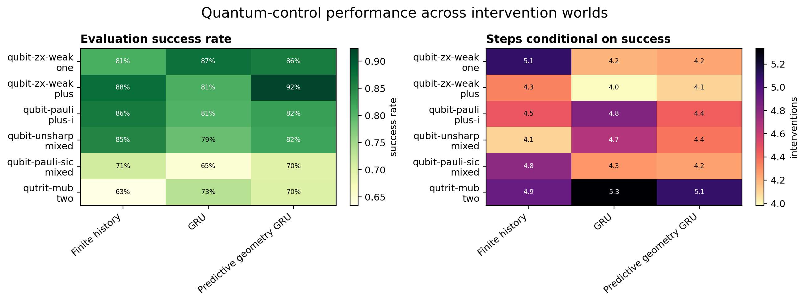
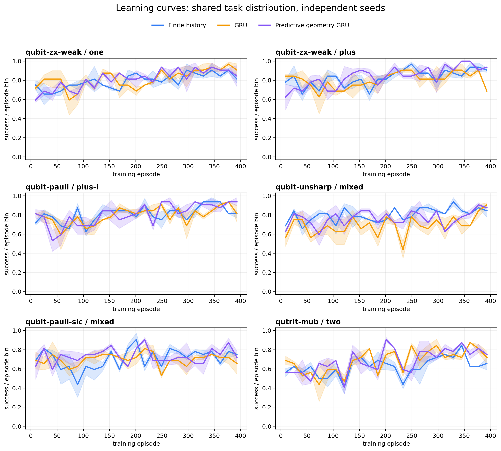
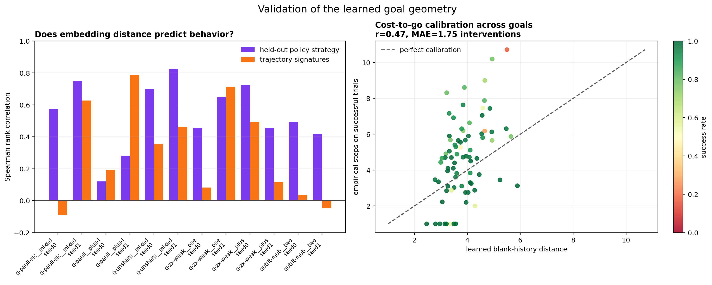

# Comparative Experiments

## Questions

1. How do finite-history Q-learning, reward-only recurrent learning, and the
   predictive/geometry recurrent agent compare across different intervention
   repertoires and hidden initial states?
2. Does Euclidean separation of learned goal embeddings agree with strategy
   distance measured on held-out histories?
3. Does that embedding geometry agree with a more independent geometry of
   complete trajectory signatures?
4. Is directed cost calibrated to empirical hitting time, and how do individual
   intervention/outcome events move the vector of goal distances?

## Metrics

- **Success rate:** fraction of evaluation episodes completing the goal within
  the fixed horizon.
- **Conditional steps:** mean interventions among successful episodes. Read it
  beside success rate because lucky short runs can look artificially efficient.
- **Strategy distance:** square-root Jensen–Shannon distance between soft
  goal-conditioned policies, averaged over held-out encountered histories.
- **Trajectory distance:** Euclidean distance between action frequency,
  action/outcome frequency, normalized duration, and success signatures.
- **Reachability calibration:** blank-history learned distance compared with
  empirical hitting time and the full finite-horizon success curve.
- **Intervention displacement:** mean change in all learned distances after each
  observed action/outcome pair. Negative means closer.

## Reproduction

```bash
conda run -n qbist_spacetime python run_experiment_suite.py \
  --scenarios qubit-zx-weak:one,qubit-zx-weak:plus,qubit-pauli:plus-i,qubit-unsharp:mixed,qubit-pauli-sic:mixed,qutrit-mub:two \
  --backends tabular,gru,multi-gru \
  --seeds 0,1 \
  --episodes 400 \
  --eval-episodes 100 \
  --geometry-episodes 40 \
  --max-steps 15 \
  --epsilon-decay 0.99 \
  --device cpu \
  --output results/comparative

python plot_results.py results/comparative
```

## Results

The production suite completed 14,400 training episodes (107,804
interventions), 26,400 evaluation episodes (179,342 interventions), and 3,520
additional held-out geometry episodes. These totals span 36 trained agents: six
world/state scenarios, three backends, and two seeds. The raw configuration is
in `results/comparative/manifest.json`.



### Control performance

Mean results across the two seeds are:

| world / initial state | finite history | GRU | predictive geometry GRU |
|---|---:|---:|---:|
| qubit Z/X/weak-Z / `one` | 81.0% | **87.4%** | 86.1% |
| qubit Z/X/weak-Z / `plus` | 87.8% | 80.9% | **92.4%** |
| qubit Pauli / `plus-i` | **86.3%** | 80.6% | 82.5% |
| qubit unsharp / `mixed` | **84.9%** | 78.8% | 82.0% |
| qubit Pauli+SIC / `mixed` | **71.3%** | 64.9% | 69.7% |
| qutrit MUB / `two` | 63.4% | **73.4%** | 70.3% |
| **macro-average** | 79.1% | 77.7% | **80.5%** |

No backend dominates every world. The recurrent state helps most clearly on the
qutrit scenario and on the original world starting from `one`; the tabular
agent is strongest on the Pauli, unsharp, and Pauli+SIC scenarios at this short
budget. The predictive geometry model has the best macro-average and a clear
advantage for the `plus` initial state, but not a universal one.

The more expressive agents are also less stable. The mean absolute difference
between their two seed success rates is 11.0 percentage points for the
predictive geometry GRU, 8.2 for the plain GRU, and 2.1 for tabular Q-learning.
The largest predictive-GRU seed gap is 24.3 points. With only two seeds, these
results are descriptive; they are not confidence intervals or significance
tests.

The hardest goals expose horizon and representation limits. Both recurrent
agents had zero success on the three-checkpoint qutrit goal `Z0_F0_P0`; the
tabular baseline reached 15%. The plain GRU also had zero success on
`Z0_SIC0`. Longer training and a compositional goal encoder are warranted.



### Goal-geometry validation



Across 12 predictive-geometry runs, embedding distance has mean Spearman rank
correlation 0.54 with held-out policy strategy distance (median 0.53, range
0.12–0.83). This is meaningful but imperfect agreement with the behavioral
quantity used by the regularizer.

Agreement with the more independent trajectory-signature distance is weaker:
mean correlation 0.31, median 0.27, and range -0.09–0.79. Geometry is therefore
not a single robust object yet. Some seeds organize whole trajectories well;
others mainly reproduce local policy similarity.

The first two principal components explain 77.3% of embedding variation on
average (53.0% plus 24.3%), making two-dimensional views informative but not
lossless.

The cost head is directionally informative but poorly calibrated as literal
hitting time. Across 79 goals with at least one held-out success, its prediction
correlates 0.47 with empirical conditional steps, with mean absolute error 1.75
interventions. Predictions occupy a compressed range (2.46–5.89) while observed
means range from 1.0 to 10.71. The finite-time reachability curves should be
preferred whenever risk and failure probability matter.

The Pauli+SIC displacement map gives the cleanest qualitative result. In seed
1, observing `Z:0`, `X:0`, and `Y:0` changes the learned distance to their
matching primitive goals by -1.58, -1.80, and -1.91 respectively. The four SIC
outcomes move their matching goals by -2.43 to -2.95, while most nonmatching
goal distances increase. The visualization makes measurement backaction look
like a directed movement through affordance coordinates rather than mere
information acquisition.

Representative per-run views:

- `results/comparative/plots/qubit-pauli-sic__mixed__multi-gru__seed1/goal_geometry.png`
- `results/comparative/plots/qubit-pauli-sic__mixed__multi-gru__seed1/intervention_displacements.png`
- `results/comparative/plots/qubit-pauli-sic__mixed__multi-gru__seed1/reachability_curves.png`

### Interpretation limits

- Every backend receives the same episode budget, not the same compute budget.
- Two seeds reveal instability but are insufficient for formal uncertainty.
- Conditional steps omit failures and can reward lucky policies; success rate
  and reachability curves remain primary.
- Goal embeddings use an explicit strategy-distance regularizer. Their held-out
  agreement is a calibration result, not spontaneous discovery without bias.
- The learned cost is trained off-policy with a minimum backup and is not yet a
  trustworthy metric in absolute units.
- Generated models and plots are exploratory artifacts, not frozen benchmark
  releases. The manifest and code make a larger rerun straightforward.
