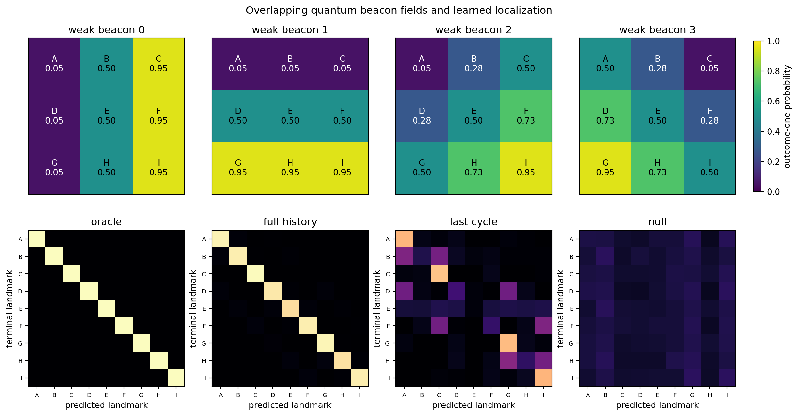
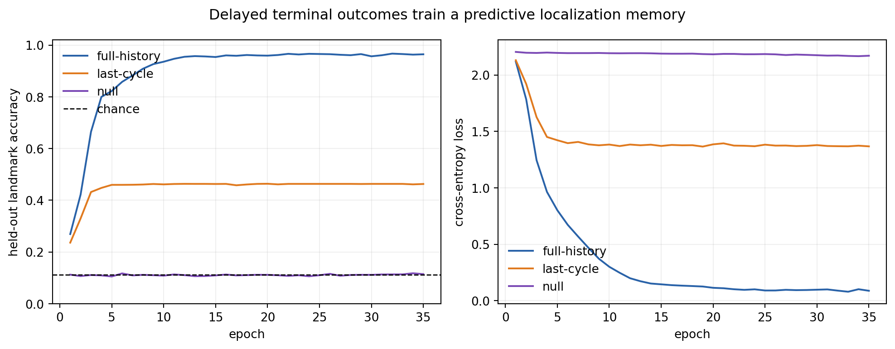
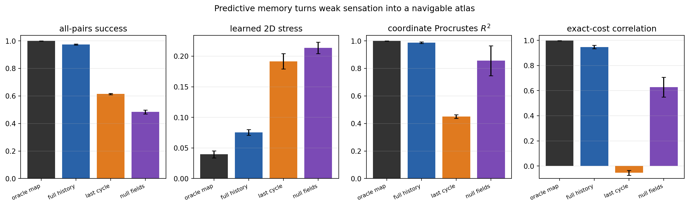
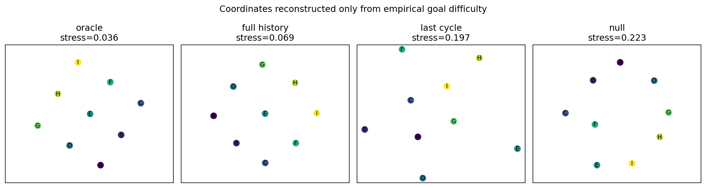
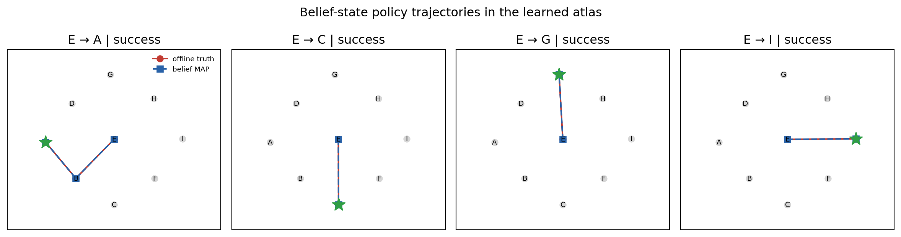

# A Predictive Atlas from Weak Quantum Beacons

## Status and research decision

This is the project's most promising implemented direction as of 2026-08-11.
The first spatial construction showed that a learned intervention-cost geometry
can be two-dimensional, but the successful agent was handed an exact place
symbol before every decision. That observation made the controller
coordinate-free, but not genuinely self-localizing. The present experiment
removes that online symbol.

The replacement is a **predictive atlas**. Four individually ambiguous binary
quantum instruments act as weak beacons. A recurrent model integrates their
outcomes, predicts which landmark a terminal probe would report, and supplies a
belief over nine operational places. A transition model learned from
landmark-anchored surveys then supports stochastic shortest-path planning in
that belief space. The all-pairs costs of the resulting policies define the
hodological distance matrix; multidimensional scaling tests whether it is
compatible with ordinary two-dimensional space.

The production result is positive but deliberately bounded. The full-history
agent achieves (0.973\pm0.004) held-out all-pairs success, compared with
(1.000\pm0.001) for an online localization oracle. Its cost geometry has 2D
stress (0.075\pm0.005), concealed-coordinate Procrustes
(R^2=0.987\pm0.005), and correlation (0.948\pm0.013) with the exact
stochastic-shortest-path costs. Exact coordinates, density matrices, Kraus
operators, and beacon likelihoods are withheld from the online agent.

This is not yet unsupervised discovery of space. Landmark outcomes supervise
the atlas after a terminal commitment, transition surveys begin from a
previously verified landmark, the latent Hilbert basis has nine designed
places, and movement is an entanglement-breaking quantum walk. Those
limitations identify the next experiments rather than weakening the present
comparison.

## 1. Why this direction matters

The project's motivating conjecture is operational: an agent should call two
goals near when little reliable effort separates them, and far when moving
between them is difficult. A familiar physical space would then be a special
case in which the pairwise goal difficulties admit a low-dimensional,
approximately Euclidean representation.

The earlier `qudit-grid-3x3` study established an existence proof with a sharp
place report. The next scientific bottleneck was therefore not a larger grid
or a more elaborate plot. It was the information boundary. If the agent must
already know “where it is” in order to reconstruct space, much of the desired
emergence has been assumed. Weak, repeated, overlapping observations provide a
controlled intermediate problem:

1. no individual observation names a place;
2. history is provably useful because repeated samples increase information;
3. the information has a valid quantum-instrument realization;
4. a terminal landmark can provide a delayed training target without becoming
   an online navigation cue;
5. matched memory and null-information controls isolate why the method works.

The construction is consequently a bridge from an observed state label to an
agent-maintained predictive state.

## 2. Quantum environment

### 2.1 Hilbert space and latent sites

The hidden system has Hilbert space

\[
\mathcal H=\operatorname{span}\{|s\rangle:s=0,\ldots,8\},
\qquad \dim\mathcal H=9.
\]

For privileged validation only, the simulator associates the labels with a
concealed (3\times3) arrangement. The agent sees landmark names
(A,\ldots,I), never the associated coordinates. Calibration episodes prepare
localized states

\[
\rho_s=|s\rangle\langle s|.
\]

The canonical reset state is the center landmark (E). Uniform all-pairs
evaluation additionally starts from every landmark so that geometry is not
inferred from a single origin.

### 2.2 Blind movement instruments

There are eight movement actions: north, south, east, west, and four
diagonals. The agent observes only a binary success/failure outcome. A movement
instrument contains source-resolved Kraus events that are coarse-grained into
those two reports. For a legal move (s\mapsto f_a(s)) with success
probability (p_a), one may write

\[
K^{(a)}_{1,s}=\sqrt{p_a}\,|f_a(s)\rangle\langle s|,
\qquad
K^{(a)}_{0,s}=\sqrt{1-p_a}\,|s\rangle\langle s|.
\]

At a boundary, the attempted displacement remains at the same site. Axial
moves have unit success on legal edges. Diagonal moves use (p_d=0.715), the
value selected in the first inverse-design study because their expected cost
(1/p_d\) approximately matches (sqrt2) axial cost units. The completeness
condition

\[
\sum_{o\in\{0,1\}}\sum_s
K^{(a)\dagger}_{o,s}K^{(a)}_{o,s}=I
\]

holds for every movement action. Because the source-resolved Kraus label is not
reported, movement success does not reveal the destination.

### 2.3 Weak QND beacon instruments

Actions 8--11 are binary quantum-nondemolition beacons. Beacon (b) has a
place-dependent response probability (q_{bs}), with diagonal Kraus operators

\[
B^{(b)}_0=\sum_s\sqrt{1-q_{bs}}|s\rangle\langle s|,
\qquad
B^{(b)}_1=\sum_s\sqrt{q_{bs}}|s\rangle\langle s|.
\]

Therefore

\[
B^{(b)\dagger}_0B^{(b)}_0+B^{(b)\dagger}_1B^{(b)}_1=I.
\]

On localized inputs the state is unchanged while the report is Bernoulli with
parameter (q_{bs}). The four fields vary horizontally, vertically, along a
diagonal, and along an anti-diagonal. Their probabilities deliberately overlap:
no one outcome, and generally no one beacon sample, identifies a site. Their
joint response fingerprints are distinct, so repeated action/outcome history
can localize the system statistically.

The null environment retains the same movements and action alphabet but sets
(q_{bs}=1/2) everywhere. It controls for model size, token count, computation,
and terminal supervision while removing all place information from the scan.

### 2.4 Common terminal landmark probe and goals

Action 12 is the sole sharp landmark probe,

\[
L_s=|s\rangle\langle s|,
\qquad s=0,\ldots,8.
\]

All nine goals share this action: goal (g) is achieved if the terminal probe
reports landmark (g). During navigation, invoking the probe is an irrevocable
commitment and ends the episode whether correct or not. Its outcome can
therefore train or score a prediction, but cannot be used to choose a later
action in the same episode. This temporal separation is central to the
information boundary.

## 3. Learning the predictive place representation

### 3.1 Delayed-label calibration data

A calibration example begins at a landmark, applies the fixed scan

\[
(8,9,10,11)^{12},
\]

and then performs the terminal landmark probe. The input is the 48-token
sequence

\[
h=((a_1,o_1),\ldots,(a_{48},o_{48})),
\]

while the delayed probe outcome supplies target (s). Because the beacons are
QND on localized states, all samples describe one latent site. There are 400
calibration and 200 independent test histories per site and seed.

This target is operational: it is a possible future experience under an
available intervention. It is not a coordinate, density matrix, or simulator
state. Nevertheless, it is supervision, so the correct description is
**delayed landmark prediction**, not unsupervised representation learning.

### 3.2 GRU localizer

Each action/outcome pair is embedded as a token (x_t). A gated recurrent unit
updates memory by

\[
r_t=\sigma(W_rx_t+U_rh_{t-1}+b_r),
\]
\[
u_t=\sigma(W_ux_t+U_uh_{t-1}+b_u),
\]
\[
\widetilde h_t=\tanh(W_hx_t+U_h(r_t\odot h_{t-1})+b_h),
\]
\[
h_t=(1-u_t)\odot h_{t-1}+u_t\odot\widetilde h_t.
\]

A linear-softmax head produces a belief-like posterior

\[
\widehat b(s\mid h)=
\frac{\exp(w_s^\top h_{48}+c_s)}
{\sum_j\exp(w_j^\top h_{48}+c_j)}.
\]

Training minimizes categorical cross entropy. Held-out evaluation additionally
reports accuracy, negative log likelihood, multiclass Brier score, confidence,
and entropy. An exact Bayes classifier using the concealed beacon
probabilities is evaluated only as an offline ceiling. The GRU's 0.964 accuracy
lies close to the 0.977 ceiling, showing that most available scan information
is recovered.

### 3.3 Why the controls are diagnostic

The full-history and last-cycle models see the same 48 beacon outcomes during
data collection and navigation. The last-cycle control discards the first 44
tokens before inference, retaining only one sample from each beacon. It reaches
0.463 accuracy, essentially its exact Bayes ceiling of 0.463. Thus its failure
is an information-budget result, not an optimization failure.

The null model integrates all 48 tokens but obtains 0.114 accuracy, consistent
with (1/9) chance and the 0.111 Bayes ceiling. Thus recurrence alone does not
manufacture place information.

## 4. Learning action consequences

The agent also needs a map of how blind movements alter possible landmarks.
For each previously verified source landmark (s) and movement (a), the
survey applies the move, observes (o\in\{0,1\}), and immediately commits with
the landmark probe to obtain (s'). Repeating this 100 times estimates

\[
\widehat T_a(o,s'\mid s)
=\widehat P(o_t=o,S_{t+1}=s'\mid S_t=s,A_t=a).
\]

The survey does not use coordinates or Kraus operators, but it does use
landmark-anchored starting conditions and terminal labels. The mean total
variation error against the privileged exact kernel is
(0.0144\pm0.0008), confirming that the sample budget is sufficient on this
small world.

The outcome-conditioned kernel is important. If the current belief is (b_t)
and movement report (o_t) is observed, Bayes filtering gives

\[
b_{t+1}(s')=
\frac{\sum_s b_t(s)\widehat T_{a_t}(o_t,s'\mid s)}
{\sum_{j,s} b_t(s)\widehat T_{a_t}(o_t,j\mid s)}.
\]

Successful and failed attempts therefore change the predictive position even
though neither report explicitly names the new site.

## 5. Planning in the learned atlas

Marginalizing over reports gives

\[
\widehat P_a(s'\mid s)=\sum_o\widehat T_a(o,s'\mid s).
\]

For each goal landmark (g), value iteration solves the stochastic
shortest-path Bellman equations

\[
V_g(g)=0,
\qquad
V_g(s)=\min_a\left[1+\sum_{s'}
\widehat P_a(s'\mid s)V_g(s')\right]
\quad(s\ne g).
\]

The corresponding action cost is

\[
Q_g(s,a)=1+\sum_{s'}\widehat P_a(s'\mid s)V_g(s').
\]

At run time, the controller chooses a movement by averaging this cost over its
current belief,

\[
a_t^*=\arg\min_a\sum_s b_t(s)Q_g(s,a).
\]

If the most probable landmark is the goal, it commits with the terminal probe.
Otherwise it moves and filters the binary outcome. Coordinates never enter
this loop.

The present planner does not rescan after every move. Initial uncertainty is
represented by the scan posterior and later uncertainty is propagated through
the learned action model. This makes the trajectory a path through predictive
beliefs rather than a sequence of supplied place labels.

## 6. From goal difficulty to geometry

For every ordered source--goal pair, 100 frozen-policy episodes estimate
success and restricted movement cost. The 48 fixed beacon actions and terminal
probe are reported as total interventions but excluded from the hodological
movement matrix: they add the same large localization overhead to every pair
and would otherwise flatten relative spatial structure. Failed trials are
censored at the 12-move deadline, so success must be inspected before geometry.

Let (C_{ij}) be empirical movement cost from landmark (i) to goal (j).
Directed asymmetry is retained as

\[
\mathcal A=
\frac{\|C-C^\top\|_F}{\|C+C^\top\|_F}.
\]

Only the Euclidean hypothesis test uses

\[
D=(C+C^\top)/2.
\]

Metric multidimensional scaling fits points (x_i\in\mathbb R^d) by minimizing
normalized raw stress

\[
\operatorname{Stress}_d=
\sqrt{\frac{\sum_{i<j}(\|x_i-x_j\|_2-D_{ij})^2}
{\sum_{i<j}D_{ij}^2}}.
\]

One dimension should fail, two should improve sharply, and a third should add
little if the costs are genuinely two-dimensional. Classical double centering
also provides positive-spectrum and negative-spectrum diagnostics. Concealed
coordinates enter only after learning, through Procrustes (R^2) and distance
correlation; they never select actions or fit MDS.

No single metric is sufficient:

- success establishes that “distance” refers to competent goal pursuit;
- exact-cost correlation checks recovery of the designed stochastic map;
- 1D/2D/3D stress tests intrinsic dimension;
- spectrum diagnostics expose non-Euclidean inconsistency;
- Procrustes recovery tests arrangement, which is different from metric fit;
- directionality preserves information removed by symmetrization;
- memory and null controls test causal explanations of the result.

## 7. Production protocol

The frozen production configuration is recorded in
`results/predictive-atlas/manifest.json`:

| component | setting |
|---|---:|
| independent seeds | 3 (`0,1,2`) |
| scan length | 12 cycles = 48 binary outcomes |
| calibration histories | 400 per site, 3,600 per condition and seed |
| test histories | 200 per site, 1,800 per condition and seed |
| GRU epochs | 35 |
| transition survey | 100 trials per source/action |
| navigation evaluation | 100 episodes per ordered pair |
| movement deadline | 12 moves |

Across the production study, the transition survey contains 21,600 trials and
navigation contains 97,200 held-out episodes. Navigation alone includes
4,665,600 weak-beacon outcomes. Nine trained localizer checkpoints, raw
matrices, trajectory records, summary CSVs, and five figures are retained.

## 8. Results

All intervals below are mean (\pm) sample standard deviation across three
seeds.

### 8.1 Delayed landmark prediction

| condition | history used | accuracy | Bayes ceiling | NLL | Brier score |
|---|---:|---:|---:|---:|---:|
| full history | 12 cycles | **0.964 ± 0.008** | 0.977 ± 0.004 | 0.112 ± 0.017 | 0.055 ± 0.010 |
| last cycle | 1 of 12 cycles | 0.463 ± 0.006 | 0.463 ± 0.006 | 1.386 ± 0.025 | 0.685 ± 0.006 |
| null fields | 12 cycles | 0.114 ± 0.008 | 0.111 | 2.229 ± 0.005 | 0.896 ± 0.001 |

The full model nearly saturates the available information. The two controls
separate the contributions of temporal evidence and place-dependent sensing.





### 8.2 Navigation and geometric recovery

| condition | all-pairs success | movement cost | exact-cost correlation | 1D stress | 2D stress | 3D stress | Procrustes (R^2) |
|---|---:|---:|---:|---:|---:|---:|---:|
| oracle | 1.000 ± 0.001 | 1.485 ± 0.006 | 0.998 ± 0.001 | 0.418 ± 0.012 | 0.040 ± 0.006 | 0.039 ± 0.005 | 1.000 ± 0.000 |
| full history | **0.973 ± 0.004** | 1.742 ± 0.033 | **0.948 ± 0.013** | 0.407 ± 0.021 | **0.075 ± 0.005** | 0.043 ± 0.004 | **0.987 ± 0.005** |
| last cycle | 0.614 ± 0.005 | 5.223 ± 0.021 | -0.054 ± 0.020 | 0.412 ± 0.013 | 0.192 ± 0.013 | 0.112 ± 0.008 | 0.451 ± 0.014 |
| null fields | 0.484 ± 0.014 | 6.887 ± 0.133 | 0.628 ± 0.079 | 0.456 ± 0.006 | 0.214 ± 0.009 | 0.102 ± 0.009 | 0.856 ± 0.108 |

The full-history atlas closes most of the gap to the oracle. Its dramatic
1D-to-2D stress drop and high coordinate recovery support a two-dimensional
interpretation. The reduction from 2D to 3D, (0.075\to0.043), is not
negligible, however. Localization errors add a residual nonspatial distortion,
so this experiment supplies strong 2D recovery rather than a perfectly clean
dimension plateau. Its 2D positive-spectrum fraction is
(0.870\pm0.017), negative-spectrum fraction is (0.085\pm0.011), and
concealed Euclidean-distance correlation is (0.942\pm0.012).

The last-cycle control is the clearest failure: its cost matrix is uncorrelated
with the exact map and its coordinate recovery collapses. The null control can
occasionally yield a superficially recognizable alignment because censoring,
boundaries, and a small symmetric grid induce structure even in poor policies.
Its low success, high cost, high stress, and seed-unstable Procrustes score show
why an attractive embedding is never accepted alone.





### 8.3 Motion through predictive space

The retained trajectories display three layers: offline true site for audit,
the agent's maximum-posterior landmark, and the path plotted in coordinates
derived only from the learned all-pairs costs. Representative center-to-corner
journeys show the predictive state updating coherently after blind movement
reports. The plotted “motion” is therefore not a simulator coordinate trace
fed back to the controller; it is a visualization of belief evolution in a
goal-derived atlas.



## 9. Pilot failure and design correction

The first pilot used eight scan cycles, 200 calibration histories per site, and
20 epochs. Full-history localization reached 0.865 and navigation 0.887, but 2D
stress remained 0.184. The agent was competent enough to make progress yet too
uncertain to preserve the metric. This was scientifically useful: success
alone did not guarantee geometric fidelity.

The revised pilot used 12 cycles, 300 histories per site, and 30 epochs. It
reached localization 0.971, navigation 0.977, 2D stress 0.079, and Procrustes
(R^2=0.984). Production then increased calibration to 400 per site and used
three fixed seeds. The correction was made before the production run; the
production bundle is the only retained benchmark artifact.

## 10. What has and has not emerged

### Established in this model

- A valid family of weak QND quantum instruments supplies ambiguous
  first-person evidence about latent place.
- A recurrent model converts temporal evidence into a well-calibrated
  predictive landmark distribution.
- A learned outcome-conditioned transition model propagates that distribution
  through blind stochastic movement.
- Goal-conditioned planning succeeds without exact online place labels.
- Empirical goal difficulty strongly recovers a two-dimensional spatial
  arrangement and approximately Euclidean costs.
- Matched controls demonstrate that memory and informative intervention fields
  are causally relevant.

### Not established

- Places and dimensionality were not discovered from an unstructured Hilbert
  space; nine localized basis states were designed.
- Landmark semantics are not learned without supervision; delayed sharp-probe
  outcomes name the atlas states.
- Transition learning is not fully autonomous; surveys begin from verified
  landmarks.
- The movement channels are entanglement-breaking and the beacons commute with
  the place basis, so quantum coherence is not yet essential to the result.
- The fixed 48-probe scan is expensive. Mean total intervention count is about
  50.5 even though mean movement cost is only 1.74.
- Three seeds and a (3\times3) world do not establish continuum limits,
  topology, curvature, or universal scaling.
- Symmetric Euclidean geometry is an offline summary of a more fundamental
  directed belief-control process.

## 11. Most promising next step

The strongest successor is an **active, self-calibrating predictive atlas**.
Instead of paying for 48 fixed probes, the agent should choose whether to move,
sense, or commit according to the expected reduction in goal-relevant
uncertainty. A principled one-step sensing score is

\[
\operatorname{EIG}(b,a)=
H(b)-\sum_o P(o\mid b,a)H(b'_{a,o}),
\]

but information should be valued only insofar as it lowers expected goal cost.
One can therefore optimize

\[
a^*=\arg\min_a
\left[c(a)+\sum_oP(o\mid b,a)V_g(b'_{a,o})\right],
\]

where sensing, movement, and commitment have explicit costs. This would test
whether an agent constructs place only when place is useful for action.

Subsequent stages should:

1. learn beacon likelihoods and transitions jointly from continuous
   experience rather than separated surveys;
2. replace delayed landmark classification with contrastive future-test or
   predictive-state objectives and discover landmarks by controllability;
3. optimize noncommuting instruments through Choi or Stinespring
   parameterizations while penalizing teleportation and excessive sensing;
4. scale to larger grids, tori, spheres, defects, and position-dependent
   kernels, selecting dimension and topology out of sample;
5. attach internal quantum states to each place and test whether learned
   affordance space separates into a low-dimensional spatial base and internal
   fiber;
6. measure path-dependent internal transport, connection, and holonomy before
   attempting curvature or gravitational analogies.

## 12. Reproduction and artifact map

Run the production experiment in the project environment:

```bash
conda run --no-capture-output -n qbist_spacetime \
  python predictive_atlas.py \
  --output results/predictive-atlas \
  --seeds 0,1,2 --scan-cycles 12 \
  --calibration-per-site 400 --test-per-site 200 --epochs 35 \
  --transition-trials 100 --pair-episodes 100 \
  --max-moves 12 --device cpu

python plot_predictive_atlas.py results/predictive-atlas
```

The standalone plotter intentionally avoids PyTorch and can run in a light
NumPy/Matplotlib environment. The artifact bundle contains:

- `manifest.json`: protocol and information boundary;
- `localization_summary.csv`: held-out predictive metrics;
- `navigation_summary.csv`: competence and geometry metrics;
- `localization_learning_curves.csv`: epoch-level training/test traces;
- `matrices/`: per-seed confusion, transition, cost, and success matrices;
- `models/`: nine trained localizer checkpoints;
- `trajectories.json`: auditable belief and offline-state traces;
- five publication-ready figures.

Run focused and full tests with:

```bash
python -m unittest tests.test_predictive_atlas -v
python -m unittest discover -s tests -v
```

The tests verify quantum completeness indirectly through the common
environment validator, QND behavior, overlapping and null beacon fields,
delayed terminal labels, recurrent tensor behavior, exact Bellman planning,
and outcome-conditioned belief updates.
