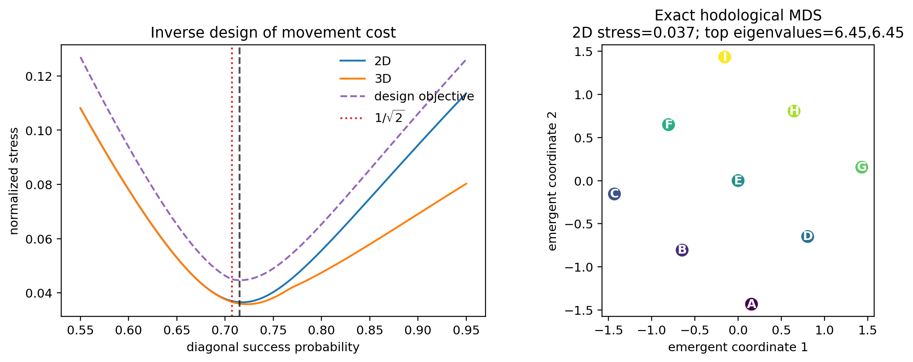
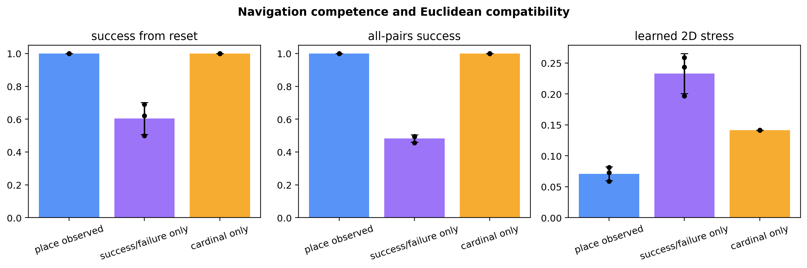
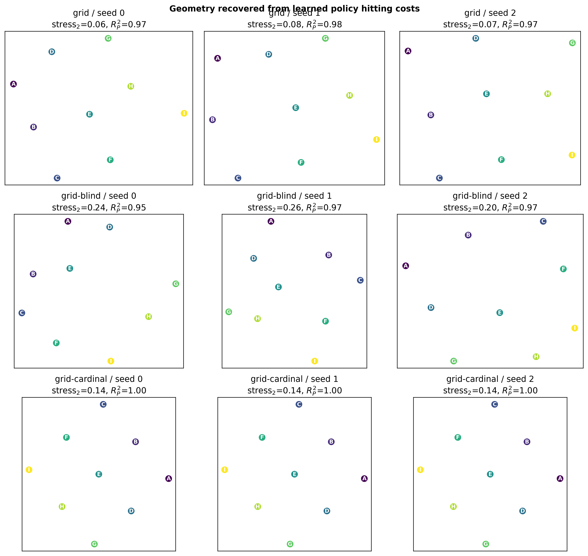
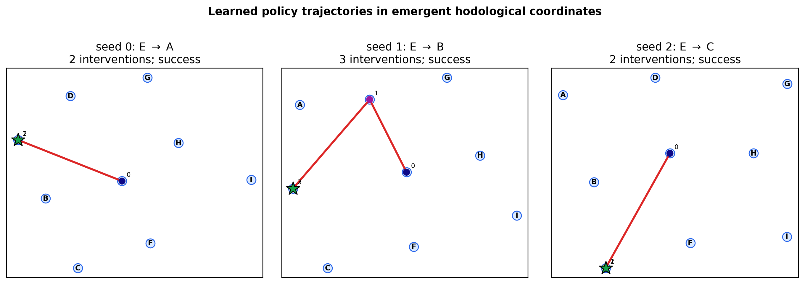
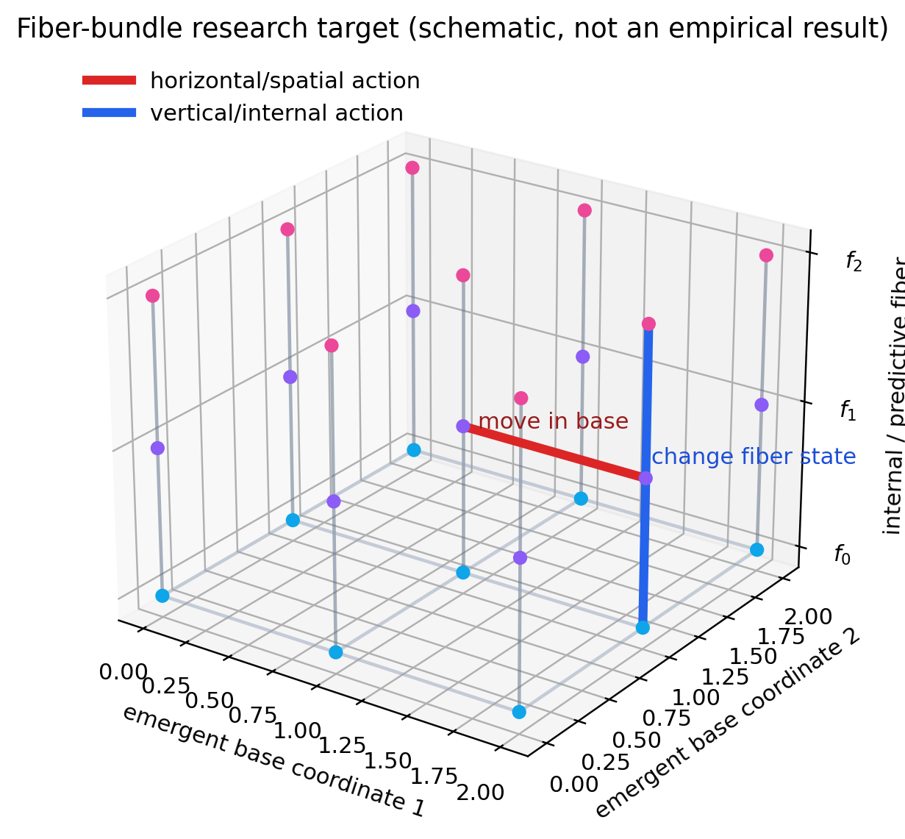

# Emergent Two-Dimensional Hodological Space

## Status

This document records the first spatial inverse-design study completed on
2026-08-11. It answers the project's first new objective:

> Identify an initial quantum state, a set of Kraus instruments, and a goal
> repertoire for which an agent can represent its goal-directed behavior as
> stochastic motion through an emergent two-dimensional space.

The answer is positive for a deliberately simple nine-dimensional construction.
It is an existence proof and a research platform, not yet a derivation of
physical space from generic quantum dynamics.

The exact experimental bundle is in [`results/spatial-hodology/`](results/spatial-hodology/),
and the complete executable study is [`spatial_hodology.py`](spatial_hodology.py).

## 1. Hodological motivation

The word *hodological* comes from the study of paths and goal-directed “life
space,” especially Kurt Lewin's [*Principles of Topological
Psychology*](https://books.google.co.uk/books?id=IGB9AAAAMAAJ) (1936). The use
here is precise and computational:

\[
d_\pi(s,g)
=
\mathbb E_\pi[\tau_g\mid s]
\]

is the expected number of interventions required for policy \(\pi\) to reach
goal \(g\) from operational state \(s\). Near goals are easy; far goals are
difficult. An optimal or learned policy induces a goal-relative geometry.

Ordinary physical space would be a special case of hodological space if:

1. operational places can be distinguished without supplying coordinates;
2. interventions act as approximately local, homogeneous displacements;
3. all-pairs goal costs are approximately symmetric and Euclidean;
4. two or three dimensions fit substantially better than fewer dimensions;
5. policy trajectories become continuous paths through that embedding.

The scientific problem is therefore an inverse problem. We do not start by
asserting that a learned embedding *is* space. We search over quantum
instruments and goals for worlds in which independent geometric tests support
that identification.

## 2. Bilevel inverse-design scheme

Let \(\theta\) parameterize an initial state and quantum instruments, and let
\(\mathcal G\) be a goal repertoire. The outer design loop is

\[
(\theta^\star,\mathcal G^\star)
=
\arg\min_{\theta,\mathcal G}
J_d\!\left(D_{\pi_{\theta,\mathcal G}}\right),
\]

where the inner loop trains an agent policy and \(D\) is its empirical
all-pairs hitting-cost matrix. A general objective should combine

\[
J_d
=
\lambda_s\operatorname{Stress}_d
+\lambda_c(1-R^2_{\rm calibration})
+\lambda_n P_{\rm nonmetric}
+\lambda_a P_{\rm asymmetry}
+\lambda_f P_{\rm failure}
+\lambda_k P_{\rm complexity}.
\]

The present first stage makes the inner geometry analytically tractable and
searches one physically meaningful parameter. Later stages can optimize Choi
matrices or Stinespring isometries while enforcing complete positivity and
trace preservation.

### Dimensional test

For symmetric distances \(D_{ij}\), metric multidimensional scaling finds
coordinates \(x_i\in\mathbb R^d\) minimizing normalized raw stress

\[
\operatorname{Stress}_d
=
\sqrt{
\frac{\sum_{i<j}(\lVert x_i-x_j\rVert-D_{ij})^2}
     {\sum_{i<j}D_{ij}^2}
}.
\]

The implementation uses classical MDS initialization followed by deterministic
SMACOF majorization. Stress is evaluated in one, two, and three dimensions.
This follows the general multidimensional-scaling program introduced by
[Kruskal](https://doi.org/10.1007/BF02289565); related manifold-learning ideas
appear in [Isomap](https://doi.org/10.1126/science.290.5500.2319).

Low two-dimensional stress alone is insufficient. We also report the fraction
of positive Gram-spectrum variance in two dimensions, the negative-spectrum
fraction, distance correlation, and Procrustes recovery of the concealed
lattice. Procrustes alignment is used only for privileged validation; the MDS
algorithm never receives the concealed coordinates.

## 3. Quantum construction

### Hilbert space and initial state

Use a nine-dimensional Hilbert space

\[
\mathcal H
=
\operatorname{span}\{\lvert x,y\rangle:x,y\in\{0,1,2\}\}.
\]

The canonical initial state is the central localized state

\[
\rho_0=\lvert1,1\rangle\!\langle1,1\rvert.
\]

Training covers all source--goal pairs by uniformly preparing one of the nine
localized states and then supplying one ordinary position-probe outcome before
the task clock begins. The source outcome is an arbitrary symbol A--I; no
coordinate or distance is supplied.

### Movement instruments

There are four axial and four diagonal actions. Let \(f_a(s)\) be the adjacent
destination of site \(s\) under action \(a\). For a legal move,

\[
K^{(a)}_{s,+}
=
\sqrt{p_a}\,\lvert f_a(s)\rangle\!\langle s\rvert,
\qquad
K^{(a)}_{s,-}
=
\sqrt{1-p_a}\,\lvert s\rangle\!\langle s\rvert.
\]

At an open boundary, \(p_a(s)=0\). Hence

\[
\sum_s
\left(
K_{s,+}^{(a)\dagger}K_{s,+}^{(a)}
+K_{s,-}^{(a)\dagger}K_{s,-}^{(a)}
\right)
=I.
\]

Every action is therefore a valid completely positive trace-preserving quantum
instrument. Axial moves have \(p_a=1\). Diagonal moves use a searched common
success probability \(p_d\).

In the main environment, unobserved source Kraus events are grouped by their
destination. The agent receives only the destination symbol. This is analogous
to a place-cell observation: it localizes but does not geometrize. In the
`blind` ablation, the same Kraus events are grouped only into success and
failure, creating a partially observed navigation problem.

### Place probe and goals

The ninth action is a sharp place probe with Kraus operators

\[
P_s=\lvert s\rangle\!\langle s\rvert,
\qquad
\sum_sP_s=I.
\]

All nine goals have the same syntax:

\[
g_s=\text{“perform the common probe and obtain outcome }s\text{.”}
\]

This avoids a separate action whose name already specifies each destination.
Place identity is observable; adjacency, axis, orientation, and distance are
not.

## 4. Why the diagonal probability matters

One axial displacement costs one intervention. Repeating a diagonal action
until success costs \(1/p_d\) interventions on average. Euclidean compatibility
therefore suggests

\[
\frac{1}{p_d}\approx\sqrt2,
\qquad
p_d\approx\frac1{\sqrt2}.
\]

The outer loop searched 81 values from 0.55 to 0.95. Its combined stress,
coordinate-recovery, and non-Euclidean-spectrum objective selected

\[
p_d^\star=0.715,
\qquad
1/p_d^\star=1.3986.
\]

This lies close to \(1/\sqrt2=0.7071\), but it was selected by the numerical
objective rather than inserted as the answer.



The exact optimized geometry has two-dimensional stress 0.0365, compared with
0.4305 in one dimension and 0.0360 in three dimensions. Two dimensions explain
93.4% of the positive centered-Gram spectrum; exact distances correlate 0.995
with concealed Euclidean distances. The cardinal-only Manhattan ablation has
2D stress 0.1416 and a much larger negative-spectrum fraction (0.217 versus
0.081).

## 5. Reinforcement-learning experiment

### Agent

The positive construction uses ordinary tabular Q-learning. Its observable
state is

\[
(g,p,\ell),
\]

where \(g\) is goal ID, \(p\) is goal progress, and \(\ell\) is the latest
place symbol. The table intentionally discards the incoming action because the
latest place outcome is Markov-sufficient. This is a learned control policy,
not a learned neural representation; using the smallest adequate learner makes
the existence result easier to interpret.

The blind ablation uses the prior six-interaction finite-history state because
its latest success/failure symbol is not Markov-sufficient.

Q-learning uses

\[
Q(s,a)\leftarrow Q(s,a)
+\alpha\left[r+\gamma\max_{a'}Q(s',a')-Q(s,a)\right]
\]

with \(\alpha=0.1\), \(\gamma=0.95\), and epsilon-greedy exploration decaying
from 1.0 to 0.05. Each run receives 6,000 random source--goal training episodes.

### Matched study

We trained three seeds in each of three worlds:

| world | hidden movement geometry | observation after a move | purpose |
|---|---|---|---|
| optimized place-observed | axial plus cost-matched diagonal | destination symbol | proposed construction |
| optimized blind | same Kraus maps | success/failure only | observability ablation |
| cardinal place-observed | axial only | destination symbol | Manhattan-metric ablation |

The study contains 54,000 training episodes and 72,900 all-pairs evaluation
episodes (nine sources, nine goals, 100 trials, three seeds, three worlds).
Failures are assigned a finite restricted-mean cost at the 12-step horizon.

## 6. Results

Values below are mean \(\pm\) sample standard deviation over three seeds.

| metric | optimized observed | optimized blind | cardinal observed |
|---|---:|---:|---:|
| all-pairs success | 1.000 ± 0.000 | 0.482 ± 0.023 | 1.000 ± 0.000 |
| 1D stress | 0.372 ± 0.011 | 0.450 ± 0.042 | 0.460 ± 0.000 |
| 2D stress | **0.071 ± 0.011** | 0.233 ± 0.032 | 0.142 ± 0.000 |
| 3D stress | 0.064 ± 0.011 | 0.228 ± 0.038 | 0.141 ± 0.000 |
| concealed-coordinate Procrustes \(R^2\) | 0.975 ± 0.005 | 0.965 ± 0.011 | 1.000 ± 0.000 |
| correlation with exact cost | 0.936 ± 0.003 | 0.865 ± 0.010 | 1.000 ± 0.000 |
| learned directionality | 0.122 ± 0.037 | 0.264 ± 0.093 | 0.000 ± 0.000 |



The central evidence for two dimensions is the dimension gap. For the proposed
world, stress falls from 0.372 in 1D to 0.071 in 2D; adding a third dimension
improves it by only 0.007. The learned configuration recovers the concealed
lattice up to similarity transform, yet the fit is imperfect because finite
samples and stochastic diagonal policies introduce asymmetry.



The cardinal control is important. Its Procrustes \(R^2\) is essentially one:
MDS recovers the arrangement of the nine places. Nevertheless its stress is
twice that of the optimized world because Manhattan distance is not Euclidean
distance. Recovering a grid-like picture is therefore weaker than recovering a
Euclidean-compatible metric.

The blind world retains some lattice order but loses both control competence
and metric quality. Thus suitable Kraus connectivity is not enough. The agent
also requires an observation/memory architecture sufficient to locate itself
within the affordance structure.

### Trajectories as motion

Each panel below embeds only the learned symmetrized all-pairs cost matrix. The
red line then maps the learner's observed place sequence into those emergent
coordinates. The green star is the pursued goal. Rotation, reflection, and
scale differ between seeds, as they must when no external frame is supplied.



The first and third policies take one stochastic diagonal move and then probe;
the second takes two movements and probes. In this limited but literal sense,
the agent's action history is motion through its learned hodological space.

## 7. Failed and corrective stages

The route to the positive result is part of the evidence:

1. **Center-only training failed as a definition of space.** Reset success was
   roughly 0.92--0.95, but arbitrary source--goal success was only about 0.25.
   A collection of routes from one origin is not an all-pairs geometry.
2. **Random starts plus success/failure observations remained hard.** At 6,000
   episodes the blind learner reached only 48% all-pairs success.
3. **Destination symbols plus an unnecessarily long finite history worked but
   fragmented place states.** Success reached 99.8%, while 2D stress remained
   about 0.16.
4. **The Markov place-symbol state solved the representational mismatch.** It
   reached 100% all-pairs success and mean 2D stress 0.071.

These failures identify conditions for spatial emergence rather than mere
hyperparameter accidents: broad source coverage, operational localization,
and a representation that quotients histories by common future affordances.

## 8. What has and has not emerged

What has emerged:

- a two-dimensional coordinate system derived from learned goal difficulty;
- a metric substantially closer to Euclidean than the Manhattan control;
- stochastic policy trajectories that become paths in that coordinate system;
- coordinate freedom: embeddings vary by rotation, reflection, and scale;
- a concrete set of states, Kraus instruments, observations, and goals that
  realizes the first objective.

What has not emerged:

- the Hilbert basis was designed to have nine latent sites;
- the channels are entanglement-breaking/measure-and-prepare on localized
  inputs, so this is a classical stochastic walk represented quantumly;
- place outcomes provide discrete localization;
- no continuum, relativistic causal structure, Lorentzian metric, curvature
  dynamics, matter, or quantum-field degrees of freedom have been derived;
- only three seeds and a small lattice were studied.

The correct conclusion is therefore: **goal difficulty can faithfully recover
a concealed 2D space under identifiable quantum-operational conditions.** The
next scientific task is to weaken those conditions and retain the result.

## 9. From space to a fiber bundle

Ordinary agents act both spatially and internally. Let the learned total
hodological state space be \(E\), the emergent spatial base be \(B\), and the
internal/predictive possibilities above place \(b\) be a fiber \(F_b\):

\[
F_b\hookrightarrow E\xrightarrow{\;\pi\;}B.
\]

The immediate computational program is:

1. give every place several internal quantum states and internal goals;
2. learn the full all-goal reachability relation without labeling action type;
3. test whether local dimensional analysis separates two stable base
   dimensions from additional fiber dimensions;
4. learn local trivializations \(\pi^{-1}(U)\simeq U\times F\) and transition
   maps on overlapping neighborhoods;
5. classify interventions as approximately horizontal (spatial transport),
   vertical (internal change), or coupled;
6. measure holonomy: carry an internal state around a closed base loop and ask
   whether it returns unchanged.



This figure is a research schematic, not a result. Holonomy would provide a
first operational bridge toward connection and curvature. For stochastic
learned transition kernels, [Ollivier's Ricci curvature of Markov
chains](https://doi.org/10.1016/j.jfa.2008.11.001) is a mathematically grounded
discrete diagnostic. It should be treated as an exploratory bridge, not as
evidence for Einstein dynamics.

## 10. Next experiments

### Remove explicit localization

**Implemented in the predictive-atlas successor study.** The exact online place
probe was replaced by four ambiguous binary QND beacons and blind movement
reports. A GRU integrates repeated scans, a learned outcome-conditioned model
propagates its belief, and a terminal landmark probe supplies delayed labels
without informing a later navigation action. Across three seeds the agent
reaches (0.973\pm0.004) all-pairs success, 2D stress
(0.075\pm0.005), and Procrustes (R^2=0.987\pm0.005). See
`PREDICTIVE_ATLAS.md` for theory, controls, and artifacts.

### Optimize the quantum channel rather than one probability

Parameterize each action by a Stinespring isometry or positive Choi matrix.
Use an evolutionary outer loop first; later use differentiable meta-gradients
through a model-based inner learner. Penalize nonlocal transitions and channel
complexity so the optimizer cannot solve the task by goal-specific teleportation.

### Optimize the goal repertoire

Select landmark goals for coverage, local identifiability, and stable
trilateration. Hold out places and test whether their locations can be inferred
from distances to learned landmarks.

### Scale and topology

Repeat on larger open grids, tori, cylinders, spheres, and graphs with defects.
Use persistent homology, neighborhood preservation, and out-of-sample stress to
distinguish dimension from topology.

### Curvature and dynamics

Let movement probabilities depend on position, learn local metric tensors, and
compare graph geodesics, transport curvature, and loop holonomy. Only after
curvature is robustly operational should one test any analogue of field
equations relating transition dynamics to an effective source distribution.

### Toward spacetime

A spacetime generalization cannot be obtained by appending time as another
Euclidean coordinate. It requires causal reachability, directed cones of
possible future goals, clock goals, and an indefinite or order-theoretic
structure. Candidate diagnostics include causal-set dimension estimators,
proper-time-like maximal chains, and observer-dependent simultaneity derived
from achievable signaling tasks.

## 11. Reproduction

```bash
python -m unittest discover -s tests -v
python spatial_hodology.py \
  --output results/spatial-hodology \
  --seeds 0,1,2 \
  --episodes 6000 \
  --pair-episodes 100 \
  --max-steps 12
```

The manifest records the exact chosen instrument parameter and every run-level
metric. CSV files retain design-search values, exact matrices, learned cost and
success matrices, Q tables, and example policy trajectories. PNG files are
generated from those recorded data; the separately labeled fiber-bundle
schematic is generated directly by the same script.

---

## 12. Successor result and revised interpretation

The predictive-atlas experiment changes one conclusion of this document. An
exact observed place symbol is not necessary for the (3\times3) geometry.
What is necessary is an operationally sufficient predictive state. Twelve
cycles of overlapping beacon evidence allow a recurrent localizer to approach
its exact Bayes ceiling, and belief-space planning preserves most oracle
performance. A matched single-cycle control and a place-independent null
control fail both navigation and metric recovery.

The successor strengthens the existence claim in three respects:

1. **Place is predicted, not reported.** The online state is a distribution
   over possible future landmark experiences.
2. **Movement is filtered, not observed.** Binary outcomes update the place
   belief through an empirically learned joint transition model.
3. **Motion is agent-relative.** Saved paths can be drawn through coordinates
   inferred from goal costs while the controller itself operates only on
   histories, beliefs, and goal labels.

It also reveals a new limitation. The full-history 2D stress of 0.075 falls to
0.043 in 3D, a larger residual gain than in the sharp-place existence proof.
Imperfect localization introduces nonspatial metric distortion. Low-dimensional
space should therefore be evaluated as a joint property of dynamics, sensor
design, memory, and policy—not dynamics alone.

The sharp landmark remains present as delayed supervision, transition surveys
are landmark-anchored, and the scan costs 48 interventions. The revised next
objective is an active, self-calibrating atlas in which sensing competes with
movement under the same cost-to-go. Only after this should landmarks
themselves be discovered from predictive and controllability structure.
