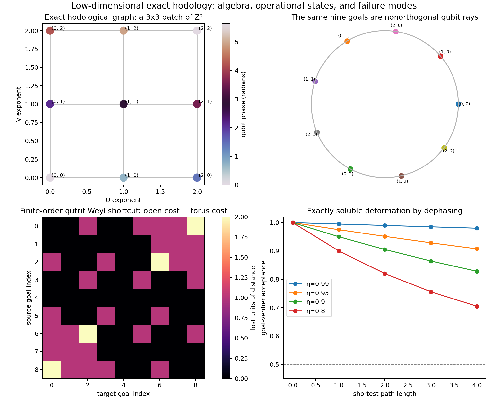

# An exactly soluble qubit model of a two-dimensional hodological lattice

## Result in one sentence

Nine orthogonal states are not necessary: two commuting, rationally
independent qubit phase rotations give a faithful action of
\(\mathbb Z^2\), and nine nonorthogonal orbit goals selected as a
\(3\times3\) patch have exactly the open square-lattice Manhattan metric.
With norm-priced translation macro-actions, the same goals have exactly their
ordinary Euclidean distances.

This is a proof-level construction, not a fitted numerical coincidence. It
also exposes two limitations that a useful physical theory must confront:
finite-order qutrit actions wrap the lattice into a torus, while finite
measurement resolution destabilizes the irrational encoding.

## 1. Why low Hilbert dimension does not bound the number of goals

A \(d\)-dimensional Hilbert space has at most \(d\) mutually orthogonal pure
states, but it has continuously many distinct rays. Orthogonality bounds the
number of states that can be distinguished perfectly in one shot; it does not
bound the number of states an agent can control, nor the size of an orbit under
a family of actions.

The relevant object for hodology is therefore not just the state set. Let a
group or semigroup \(\Gamma\) of available action words act on a fiducial state
\(|\psi_0\rangle\). The goal reached by a word \(g\) is

\[
 |\psi_g\rangle=\pi(g)|\psi_0\rangle,
\]

and the cost from goal \(g\) to goal \(h\) is the cheapest action word that
maps one ray to the other. If

\[
 K_{\psi}=\{k\in\Gamma:\pi(k)|\psi_0\rangle
                \sim |\psi_0\rangle\}
\]

is the projective stabilizer of the fiducial, then the agent experiences the
word metric on the quotient \(\Gamma/K_\psi\). Thus a qubit can support an
infinite goal graph whenever its controlled orbit is infinite. What low
dimension sacrifices is not cardinality but simultaneous distinguishability
and robustness.

This orbit--stabilizer statement is the core necessary-and-sufficient
condition. For a desired set of lattice displacements \(\Delta\), its intended
word distances survive precisely when no stabilizer element supplies a
shorter representative:

\[
 d_{\rm hod}(0,\Delta)
 =\min_{k\in K_\psi}\|\Delta+k\|_{\mathcal A}
 =\|\Delta\|_{\mathcal A}.
\]

Faithfulness, \(K_\psi=\{0\}\), is sufficient for the entire infinite
lattice. It is stronger than necessary for a finite patch; on a patch one only
needs the displayed equality for its finite difference set.

## 2. The exact qubit construction

Take the equatorial fiducial and two diagonal unitary actions

\[
 |+\rangle={|0\rangle+|1\rangle\over\sqrt2},\qquad
 U=\begin{pmatrix}1&0\\0&e^{i\alpha}\end{pmatrix},\qquad
 V=\begin{pmatrix}1&0\\0&e^{i\beta}\end{pmatrix}.
\]

The four cardinal actions are the single-Kraus instruments
\(\{U\},\{U^\dagger\},\{V\},\{V^\dagger\}\). Their completeness is immediate:
\(K^\dagger K=I\). Choose a nonzero rational \(\epsilon\), here
\(\epsilon=10^{-2}\), and set

\[
 \alpha={2\pi\over9}+\epsilon\sqrt2,
 \qquad
 \beta={2\pi\over3}+\epsilon\sqrt3.
\]

The nine goals are

\[
 G_{ij}:\quad |\psi_{ij}\rangle=U^iV^j|+\rangle,
 \qquad i,j\in\{0,1,2\}.
\]

They are neither basis states nor mutually orthogonal. They are nine different
phases of one qubit on the equator of the Bloch sphere.

### Proof of faithfulness

Suppose \(U^aV^b|+\rangle\sim|+\rangle\). Equality of the relative phase gives

\[
 a\alpha+b\beta=2\pi m,
 \qquad a,b,m\in\mathbb Z.
\]

Substitution yields

\[
 2\pi\left({a\over9}+{b\over3}-m\right)
 +\epsilon(a\sqrt2+b\sqrt3)=0.
\]

The second term is algebraic. If the rational coefficient of \(\pi\) were
nonzero, the equation would make \(\pi\) algebraic, contradicting its
transcendence. Hence both terms vanish. The remaining equation
\(a\sqrt2+b\sqrt3=0\) has no nonzero integer solution, so \(a=b=0\).
Therefore \(K_\psi=\{0\}\).

Any word in the four actions reduces, because \(U\) and \(V\) commute, to
\(U^aV^b\). To take \(G_{ij}\) to \(G_{kl}\), faithfulness forces
\((a,b)=(k-i,l-j)\). Every such word has length at least
\(|k-i|+|l-j|\), and a word containing the required cardinal moves attains the
bound. Consequently

\[
 \boxed{d_1(G_{ij},G_{kl})=|k-i|+|l-j|.}
\]

This is exactly the shortest-path metric of an open \(3\times3\) square
lattice. All 81 ordered source--goal calculations reach terminal fidelity one
to floating-point precision; the maximum measured infidelity was
\(6.7\times10^{-16}\).

### Goals as sequence languages

A goal can be stated without mentioning coordinates: it is the set of action
sequences whose signed \(U\)- and \(V\)-exponent totals equal the required
displacement. For a finite episode horizon \(H\), this is a finite language and
therefore regular. A DFA may track
\((a,b,t)\in[-H,H]^2\times\{0,\ldots,H\}\), sending invalid or overlong
histories to a dead state and accepting the desired final exponent pair. With
\(H=4\), every shortest transition among the nine goals is retained. Thus the
same construction can be read either as state-goal control or as an elaborate
regular-language sequence-goal problem.

Without a horizon the exact exponent language is not regular: it needs two
unbounded counters. This matters conceptually. Calling an unbounded sequence
goal “regular” would silently supply an infinite-memory recognizer.

## 3. Exact ordinary Euclidean distance with unit-cost interventions

Cardinal unit-cost actions produce Manhattan distance, the standard graph
distance of a square lattice. A first mathematical formulation of straight-line
distance is to provide translation macro-actions

\[
 K_{ab}=U^aV^b,
 \qquad c(K_{ab})=\sqrt{a^2+b^2}.
\]

For the finite patch only the 24 nonzero displacements in
\(\{-2,-1,0,1,2\}^2\) are needed. A direct macro-action attains
\(\sqrt{(k-i)^2+(l-j)^2}\). Conversely, every composite path has at least this
cost by the Euclidean triangle inequality. Hence

\[
 \boxed{d_2(G_{ij},G_{kl})=
 \sqrt{(k-i)^2+(l-j)^2}.}
\]

The numerical maximum error against the ordinary planar coordinate distance
is exactly zero. But variable externally assigned action prices are less
satisfying than a common intervention cost. The same geometry can instead be
put into a binary Kraus instrument. Let every attempt cost one and define

\[
 K_{\rm success}(a,b)={1\over\sqrt{r}}U^aV^b,
 \qquad
 K_{\rm failure}(a,b)=\sqrt{1-{1\over r}}I,
 \qquad r=\sqrt{a^2+b^2}.
\]

Because nonzero integer displacements have \(r\geq1\), these operators are
well-defined and satisfy the completeness relation. Their outcome
probabilities are state independent. On failure the conditional state is
unchanged; on success it is translated exactly. Retrying has a geometric
waiting time of mean

\[
 \mathbb E[T_{ab}]={1\over p_{ab}}=r.
\]

Thus a direct translation realizes the Euclidean distance using only unit-cost
interventions. Any strategy decomposing the displacement into
\(\delta_1+\cdots+\delta_n\) has expected cost
\(\sum_s\|\delta_s\|_2\geq\|\sum_s\delta_s\|_2\) by the triangle inequality,
so no composite strategy is cheaper. Fifty thousand geometric samples for
each of the 24 nonzero patch displacements validate the analytic means; the
largest Monte Carlo absolute discrepancy was below 0.029 interventions in the
fixed-seed run.

This result is still partly engineered: Euclidean norm is present in the
success probabilities rather than an external price schedule. It is
nevertheless useful because it separates two
questions that are often conflated:

1. can low-dimensional quantum dynamics carry the required translation
   algebra? Yes, even a qubit can;
2. why should physical Kraus probabilities select the inverse Euclidean norm
   rather than another law? The present model assumes this and does not yet
   derive it.

The second question is the more profound target for future environment
optimization.

## 4. Why the obvious qutrit Weyl construction fails for an open patch

A qutrit has the generalized Pauli pair

\[
 X|r\rangle=|r+1\pmod 3\rangle,
 \qquad Z|r\rangle=\omega^r|r\rangle,
 \qquad \omega=e^{2\pi i/3}.
\]

Modulo a global phase, the nine operations \(X^iZ^j\) form
\(\mathbb Z_3\times\mathbb Z_3\). This looks like the desired nine-site
lattice, but \(X^3=Z^3=I\). Its stabilizer kernel is
\(3\mathbb Z\times3\mathbb Z\), so the resulting geometry is a torus. For
example, open-grid distance from \((0,0)\) to \((2,0)\) is two, whereas the
single action \(X^\dagger\) reaches it on the torus. Sixteen of the 36 unordered
goal pairs have strict shortcuts in the experiment.

This is not a numerical training defect. It is an algebraic obstruction:
finite-order generators impose relations, and relations quotient the intended
translation lattice. Periodic space may be desirable in other models, but it
does not give an open planar patch unless boundary information is supplied by
an additional memory or action restriction.

## 5. Recognition is the price of compression

The exact goal label is most cleanly an action-history or word label, not an
exclusive one-shot quantum observation. Goal \(G_{ij}\) can be given a
one-sided test with the two-outcome Kraus instrument

\[
 M_{\rm yes}=P_{ij}=|\psi_{ij}\rangle\langle\psi_{ij}|,
 \qquad M_{\rm no}=I-P_{ij}.
\]

It accepts the exact target with probability one. But this verifier is not an
exclusive nine-way measurement: a different goal
\(G_{kl}\) is falsely accepted with probability

\[
 |\langle\psi_{ij}|\psi_{kl}\rangle|^2
 =\cos^2\!\left({(i-k)\alpha+(j-l)\beta\over2}\right).
\]

For the chosen angles, the minimum angular separation is 0.6352 radians and
the worst one-shot false-acceptance probability is 0.9025. Independent
repreparations and verification reduce this one-sided error to \(q^n\), but no
finite number makes nonorthogonal states perfectly distinguishable. This is
the sharp tradeoff hidden by basis-state models: Hilbert dimension does not
limit controllable goal count, yet it strongly limits operationally reliable
goal recognition.

The exact theorem concerns a history-labelled state equality and action cost.
There is no measurement that identifies all nine nonorthogonal qubit rays with
zero one-shot error. Any experimental realization must include the cost of
tracking the action/outcome history or statistically estimating whether a goal
has actually been reached. The large false-acceptance rates and the tolerant
shortcuts below are structural limitations, not implementation details.

## 6. Simulation-guided robustness checks

### Finite goal tolerance

The irrational orbit is dense on the phase circle. Exact faithfulness therefore
does not imply a positive separation over the infinite orbit. Enumerating
action exponents through radius 18 gives:

| allowed infidelity | fraction of ordered nontrivial pairs shortened | mean exact cost | mean tolerant cost |
|---:|---:|---:|---:|
| \(10^{-12}\) | 0.0000 | 2.0000 | 2.0000 |
| \(10^{-5}\) | 0.0000 | 2.0000 | 2.0000 |
| \(10^{-3}\) | 0.3056 | 2.0000 | 1.6111 |
| \(10^{-2}\) | 0.3611 | 2.0000 | 1.5000 |

The early shortcuts arise because a tolerance ball identifies nearby qubit
rays even when their integer labels differ. The result is dialectical: the
irrational representation solves exact topology beautifully, but compactness
makes a large, noise-tolerant embedding impossible without redundancy.

### Exactly soluble dephasing

After each intended unitary, apply a dephasing channel with coherence retention
\(\eta\):

\[
 D_\eta(\rho)= {1+\eta\over2}\rho
              +{1-\eta\over2}Z\rho Z.
\]

Its Kraus operators are the square roots of the displayed weights times
\(I\) and \(Z\). A shortest path of length \(L\) reduces equatorial coherence
to \(\eta^L\), so the ideal target verifier accepts with the closed-form
probability

\[
 p_{\rm accept}(L,\eta)={1+\eta^L\over2}.
\]

Twenty thousand Bernoulli trials at each of 25 \((L,\eta)\) settings agree with
this formula (see `dephasing_validation.csv`). Noise makes success depend only
on hodological path length in this homogeneous model, so the geometry remains
isotropic while reliability decays radially. Anisotropic dephasing after
\(U\) and \(V\) would instead induce a direction-dependent, Finsler-like cost.



The upper panels emphasize that the exact 2D action graph is represented by
nine points on one qubit equator. The lower panels show the qutrit wraparound
failure and the analytic dephasing deformation.

## 7. What has and has not emerged

What is exact:

- one qubit and four unitary single-Kraus actions realize a faithful
  \(\mathbb Z^2\) translation action;
- nine nonbasis, nonorthogonal goals inherit an exact open \(3\times3\)
  square-lattice word metric;
- bounded-horizon sequence formulations are regular languages;
- unit-cost binary instruments reproduce ordinary planar Euclidean distances
  through exact geometric waiting times;
- the finite qutrit Weyl alternative is provably toroidal;
- homogeneous dephasing has a closed-form radial reliability law.

What is not derived:

- the Euclidean action-price norm is stipulated rather than selected by
  learning or physical constraints;
- perfect goal recognition is impossible in one shot because the goals are
  nonorthogonal;
- exact irrational encodings are fragile at finite resolution and long
  horizons;
- the selected nine-goal patch is not dynamically bounded. The full orbit is
  infinite and dense, so “open boundary” means selection of goals, not a hard
  wall in Hilbert space;
- the quantum trajectory itself lies on a one-dimensional equatorial circle.
  Two-dimensionality belongs to the action-word/hodological geometry, not to
  the Fubini--Study geometry of the qubit states.

This last point is essential rather than embarrassing. If emergent space is
defined by feasible goal-directed transformations, its dimension can exceed
the dimension suggested by an instantaneous state manifold. But a future
theory must explain when this operational geometry is stable enough to be
treated as ordinary physical space.

## 8. Toward necessary and sufficient conditions

The prototype suggests the following hierarchy.

1. **Algebraic condition.** Available controlled channels must generate an
   action semigroup with a sufficiently large orbit. For an exact translation
   lattice, its projective stabilizer must not introduce short relations on the
   goal difference set.
2. **Metric condition.** Generator prices must induce the desired norm. This is
   a convex-geometry question about the weighted action set; Euclidean distance
   follows when the lower convex envelope of available displacement costs is
   the Euclidean unit ball, exactly or to a specified resolution.
3. **Recognition condition.** Goal states or goal processes must be
   distinguishable to the required operational tolerance at acceptable sample
   cost. Dimension bounds enter here even when they do not enter orbit size.
4. **Robustness condition.** Approximate stabilizers must not create cheap
   shortcuts within the operative horizon. A useful quantitative invariant is
   the shortest nonzero action word whose output ray lies inside an
   \(\varepsilon\)-ball of the fiducial.
5. **Homogeneity condition.** Noise and control error should depend primarily
   on displacement rather than absolute goal label if ordinary homogeneous
   space is to emerge. Controlled violations provide a route to curvature or
   position-dependent metric structure.

For deterministic group-orbit models, items 1 and 2 are already close to
necessary and sufficient. Items 3--5 are needed to turn an exact algebraic
embedding into an empirically usable spatial geometry.

## 9. Reproducibility and artifacts

Run:

```bash
python -m unittest discover -s tests -v
MPLBACKEND=Agg python run_exact_experiments.py
```

The eight tests verify Kraus completeness, exact terminal states for all 81
ordered pairs, Manhattan distances, regular bounded sequence goals,
norm-priced Euclidean macro-actions, qutrit wraparound, and the dephasing
closed form. Generated artifacts are:

- `results/all_pairs.csv`: every exact source--goal transition;
- `results/goals.csv`: phases and one-shot recognition ambiguity;
- `results/finite_tolerance.csv`: approximate-shortcut audit;
- `results/dephasing_validation.csv`: analytic and Monte Carlo acceptance;
- `results/euclidean_waiting_validation.csv`: exact geometric waiting means
  against 1.2 million fixed-seed samples;
- `results/manifest.json`: constants and headline checks;
- `results/figures/exact_qubit_lattice.png`: summary visualization.

The implementation uses NumPy for the model and Matplotlib only for the figure.
The random simulation has a fixed seed. No trained parameters are involved.
