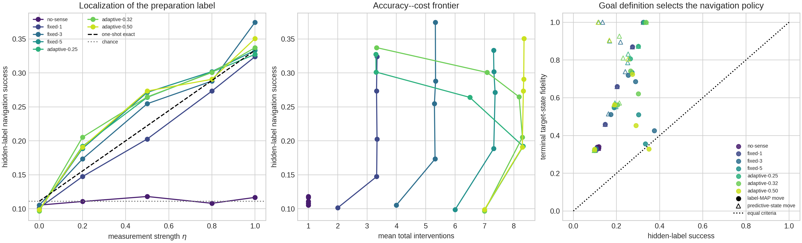
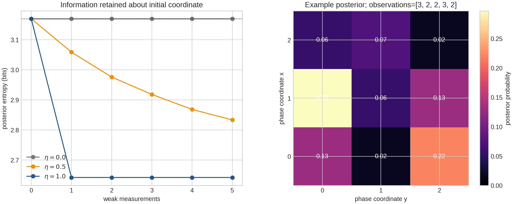

# From exact finite charts to an emergent local metric

## Decision

The most promising direction was to remove the displacement-specific action
catalog from the exact qutrit construction and force one reusable local
quantum control law to serve every source, target, and held-out displacement.
This tests whether Euclidean length is generated by local composition rather
than copied into a table of source--target macro-actions.  The complementary
operational question was to hide the start and ask whether weak quantum
observations support localization without silently replacing the state being
localized.

Both steps have now been implemented.  Together they change the research
question in a productive way.  Low Hilbert dimension is no longer the main
obstacle.  The decisive issues are the shape of the infinitesimal resource
body and the distinction between physical control state, remembered history,
and present predictive state.

## 1. What was built

### 1.1 Translation-covariant local control

A point \(x\in\mathbb R^2\) is encoded in the qutrit ray

\[
 |\psi(x)\rangle={1\over\sqrt3}\sum_{j=0}^2
 e^{i\kappa q_j\cdot x}|j\rangle,
\]

where the three \(q_j\) form an equilateral reciprocal triad.  The diagonal
unitary \(U_a\) translates every state by the same displacement \(a\):

\[
 U_a|\psi(x)\rangle=|\psi(x+a)\rangle.
\]

Each allowed displacement has a binary Kraus attempt

\[
 K_{a,s}=\sqrt{p_a}U_a,\qquad
 K_{a,f}=\sqrt{1-p_a}I.
\]

Repeated attempts have mean cost \(c_a=1/p_a\).  Unlike the earlier oracle,
the catalog is fixed before a goal is supplied and reused at every position.
Only symmetry-tied primitive costs are optimized on a radius-four disk.  An
exact Bellman/Dijkstra solver then predicts all held-out displacements through
radius twelve.

### 1.2 Hidden-start quantum localization

The localization model uses nine nonorthogonal qutrit states

\[
 |\phi_{xy}\rangle={|0\rangle+\omega^x|1\rangle+\omega^y|2\rangle\over\sqrt3},
 \qquad (x,y)\in\mathbb Z_3^2,
\]

and four unit-cost local translations.  The initial preparation label is
uniform and hidden.  A weak covariant sensor has effects

\[
 E_o(\eta)={\eta\over3}|\phi_o\rangle\langle\phi_o|
           +{1-\eta\over9}I,
\qquad K_o(\eta)=\sqrt{E_o(\eta)}.
\]

An exact Bayesian quantum filter propagates, for every possible origin, both
its posterior probability and its measurement-conditioned density matrix.
This is necessary because a classical likelihood update would ignore
backaction after the first observation.

## 2. The local-control theorem

Let \(S\) be a finite symmetric set of translation vectors and let \(c_a>0\)
be their effective costs.  The exact Bellman distance is the weighted word
metric

\[
 D_S(x)=\min\left\{\sum_i c_{a_i}:\sum_i a_i=x,\ a_i\in S\right\}.
\]

Its rescaled large-distance limit is the Minkowski gauge whose unit ball is

\[
 B_S=\operatorname{conv}\{a/c_a:a\in S\}.
\]

Because a finite convex hull is polygonal and the Euclidean unit ball is a
circle, no fixed finite direction set can equal Euclidean distance globally.
This is not a failure of optimization or Hilbert dimension; it is a geometric
obstruction.  Exact equality on a displacement occurs only when an optimal
word is composed of vectors collinear with it.  Consequently, exactness on
every primitive displacement in a radius-\(R\) patch requires on the order of
\(R^2\) slopes.

If the maximum angular gap between exposed directions is \(\Delta_{\max}\),
the worst asymptotic directional excess is bounded by

\[
 \sec(\Delta_{\max}/2)-1.
\]

Approximately uniform \(K\)-direction families therefore converge as
\(O(K^{-2})\), but every fixed \(K\) retains a nonzero anisotropy floor.

## 3. Control results

All quantum-validity and dynamic-programming checks close at numerical
precision: the maximum Kraus completeness residual is
\(2.22\times10^{-16}\), translation covariance residual
\(1.67\times10^{-16}\), and Bellman residual
\(1.78\times10^{-15}\).

| repertoire | directions | held-out Euclidean RMSE | max relative error | 2D MDS stress |
|---|---:|---:|---:|---:|
| D4 | 4 | 30.03% | 41.42% | 0.147 |
| D8 | 8 | 3.85% | 6.07% | about 0.045 |
| D16 | 16 | 3.85% | 6.07% | about 0.045 |
| D32 | 32 | **1.62%** | 4.91% | **0.0289** |

The D8 family is the best locality/accuracy compromise: its largest step is
only \(\sqrt2\), versus \(\sqrt{13}\) for D32.  D16 gives no gain because
its new knight directions lie inside the effective convex velocity hull and
are never selected by an optimal Bellman path.  This demonstrates why nominal
action count is a poor measure of expressive geometry.

The D32 metric is visually convincing but not exactly Euclidean.  On a
25-goal diagnostic patch, its Schoenberg Gram matrix retains negative
eigenmass 0.082 and more than two positive dimensions.  These diagnostics are
important: a low-stress picture alone would overstate the result.

## 4. Localization results

The production study contains 60,000 seeded episodes: five measurement
strengths, seven stopping rules and one known-start control, with 1,500 trials
per condition.  The null sensor leaves the posterior and state unchanged;
known-start movement reaches every goal exactly.

For one observation the two central quantities are analytic:

\[
 P(\widehat S=S)={1+2\eta\over9},\qquad
 F_{\rm target}={1+2\eta\over3}.
\]

At \(\eta=1\), the preparation label is recovered only with probability
\(1/3\), but the measurement prepares the reported phase state, which can be
translated to the target with fidelity one.  Later sharp observations cannot
increase information about the erased origin.  Medium-strength repeated
sensing can accumulate more origin information, but it spends interventions
and disturbs the present state.

At \(\eta=0.8\), five observations raise label accuracy from 0.273 to 0.302,
yet a controller moving according to that historical MAP label falls from
0.870 to 0.510 target fidelity.  A controller centered on the current
predictive ensemble state reaches 0.901.  The learned notion of “where I am”
therefore depends on the goal: reconstructing an origin and controlling a
present state are different tasks.

## 5. Interpretation: the beginning of a base--fiber geometry

The control experiment identifies a base action geometry.  The localization
experiment adds a fiber consisting of posterior weights and conditioned
quantum states.  Measurement changes this fiber and may also change which
base coordinate best predicts future controllability.  Three labels can then
disagree:

1. the inferred initial preparation coordinate;
2. the phase coordinate nearest the present predictive state;
3. the most recent measurement-prepared coordinate.

This is not yet a fiber bundle in the differential-geometric sense.  It is,
however, an operationally defined precursor: multiple internal states lie over
the same nominal translation site, transport and measurement act on them, and
closed-loop experiments can eventually test for holonomy.  Keeping the base
metric and sensing cost separate prevents epistemic uncertainty from being
misread as curvature.

## 6. What the result rules out

- A finite list of headings cannot generate an exactly circular large-scale
  norm, even if its costs are perfectly learned.
- Fubini--Study distance on a compact finite-dimensional ray manifold cannot
  equal an unbounded homogeneous spatial distance globally; unbounded space
  must also reside in action history, a covering structure, or memory.
- Measurement success cannot be equated with localization.  A sensor may
  prepare an easy-to-control target state while destroying information about
  the initial state.
- More actions are useful only if they become exposed directions of the
  effective velocity hull.

## 7. Most promising next experiment

The next model should replace the finite polygonal velocity body by a
continuous qutrit control disk and replace the exact filter by a learned
predictive state.  A concrete objective is:

\[
 \min_{u(t)}\int_0^T {1\over2}u(t)^T R(x_t)u(t)\,dt,
 \qquad \dot\theta=u_1,\quad\dot\phi=u_2,
\]

with commuting qutrit phase generators.  For constant positive definite
\(R\), the value induces a flat ellipsoidal Riemannian metric; allowing
\(R(x)\) to vary introduces controlled curvature.  The agent should learn
the local transition and observation model from weak-measurement histories,
then be evaluated against the exact Bayesian filter and Hamilton--Jacobi
solution.

The decisive falsifiers are:

- rotational error fails to decrease as heading resolution grows;
- a recurrent latent cannot match exact posterior calibration and predictive
  likelihood;
- apparent curvature disappears when sensing cost is separated from movement
  cost;
- closed-loop internal transport has no reproducible holonomy after controlling
  for base displacement.

This continuous-control predictive atlas is now the strongest route toward
ordinary space and, through position-dependent control tensors and internal
transport, toward the proposed bundle geometry.

## 8. Evidence and reproducibility

The detailed derivations, predetermined acceptance criteria, implementation,
and raw summaries are retained separately:

- `theory/THEORY_LOCAL_METRIC.md` -- propositions, proofs, scaling laws, and
  falsifiers;
- `control/RESULTS_LOCAL_CONTROL.md` -- optimization and held-out geometric
  diagnostics;
- `localization/RESULTS_LOCALIZATION.md` -- filter, analytic one-shot result,
  simulations, and interpretation;
- `control/results/` and `localization/results/` -- machine-readable artifacts.

The two experiment strands have 15 focused tests in total.  Production plots
were visually inspected, and every saved headline number can be regenerated by
the commands in the miniproject README.
