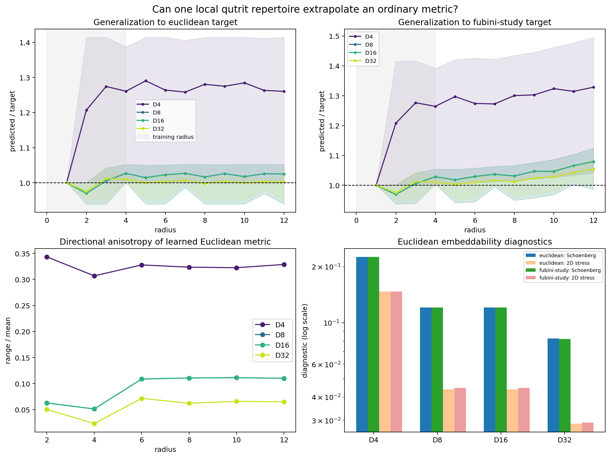

# Learning an ordinary local metric from a fixed qutrit control repertoire

## Summary

This experiment removes the most artificial feature of the exact finite-patch
model: there is no action specially constructed for a requested displacement.
Instead, a qutrit has one small, translation-covariant repertoire of local
binary Kraus instruments, reused at every site and for every goal. Only their
state-independent success probabilities are optimized on displacements of
radius at most four. Bellman distances are then tested without refitting out to
radius twelve.

The result is positive but qualified:

- four axial directions extrapolate poorly: Euclidean held-out relative RMSE
  is 30.03% and the maximum relative error is 41.42%;
- eight axial/diagonal directions reduce held-out RMSE to 3.85%, using a
  maximum step only 1.414 units long;
- sixteen directions do not improve on eight because the added \((2,1)\)
  actions are Bellman-dominated by cheaper composites;
- thirty-two directions reach 1.62% held-out Euclidean RMSE and 3.65% against
  the locally Euclidean Fubini--Study target, but their maximum local step is
  3.606, or 30.0% of the evaluation radius;
- increasing angular resolution lowers two-dimensional MDS stress from 0.147
  to 0.0289 and the Schoenberg negative-eigenmass fraction from 0.225 to 0.082,
  but neither vanishes.

Thus a fixed local quantum repertoire can produce a convincing approximate
ordinary metric far outside its fitting region. A finite direction set cannot,
however, produce the Euclidean norm exactly at all scales: its large-scale
unit ball is polygonal. Approaching a circle requires increasingly dense local
directions or a genuine continuous control family.

## 1. Qutrit translation model

Let three reciprocal vectors form an equilateral triad,

\[
 q_0=(1,0),\quad
 q_1=(-1/2,\sqrt3/2),\quad
 q_2=(-1/2,-\sqrt3/2),
\]

and encode a point \(x\in\mathbb R^2\) as the qutrit ray

\[
 |\psi(x)\rangle={1\over\sqrt3}
 \sum_{n=0}^2 e^{i\kappa q_n\cdot x}|n\rangle,
 \qquad \kappa=0.15.
\]

A displacement \(a\) is represented by the diagonal unitary

\[
 U_a=\operatorname{diag}
 \left(e^{i\kappa q_0\cdot a},e^{i\kappa q_1\cdot a},
 e^{i\kappa q_2\cdot a}\right).
\]

It obeys

\[
 U_a|\psi(x)\rangle=|\psi(x+a)\rangle
\]

exactly. This is translation covariance, not an approximate learned symmetry.
The maximum numerical covariance residual across all fitted repertoires was
\(1.67\times10^{-16}\).

For each allowed local vector \(a\), one unit-cost intervention has two Kraus
branches,

\[
 K_{a,\mathrm{s}}=\sqrt{p_a}\,U_a,
 \qquad
 K_{a,\mathrm{f}}=\sqrt{1-p_a}\,I.
\]

The completeness relation is exact. Failure leaves the conditional state
unchanged; success translates it. Repeating until success has geometric mean
cost

\[
 c_a={1\over p_a}\geq1.
\]

The optimizer changes only these \(c_a\). It cannot introduce an action, alter
an action according to the goal, or depend on absolute position.

## 2. Finite direction families and locality

The repertoires consist of primitive integer directions in bounded stencils:

| name | directions | symmetry classes | maximum step | max step / test radius |
|---|---:|---:|---:|---:|
| D4 | 4 | 1 | 1.000 | 0.083 |
| D8 | 8 | 2 | 1.414 | 0.118 |
| D16 | 16 | 3 | 2.236 | 0.186 |
| D32 | 32 | 5 | 3.606 | 0.300 |

Opposite signs and coordinate permutations share one parameter, enforcing the
square symmetries rather than asking the optimizer to rediscover them. D4 is
strict nearest-neighbor control. D8 adds diagonals. D16 adds knight directions
\((\pm2,\pm1)\) and permutations. D32 additionally includes primitive
directions with maximum coordinate three.

These are stencil actions, not displacement-specific macros: the complete set
is fixed before a source or target is supplied, and the same action is
available everywhere. Nonetheless, increasing the stencil radius weakens
locality. Reporting accuracy without the locality ratio would conceal that
tradeoff.

## 3. Bellman geometry

Translation covariance reduces every navigation problem to a displacement
\(x\). The optimal expected intervention count satisfies

\[
 V(0)=0,\qquad
 V(x)=\min_{a\in\mathcal A}\{c_a+V(x-a)\}.
\]

Because each retry-until-success edge has deterministic expected cost \(c_a\),
this is an ordinary positive-weight shortest-path problem. The implementation
solves it with Dijkstra's algorithm on a padded integer lattice. Its maximum
Bellman residual was \(1.78\times10^{-15}\).

The asymptotic geometry has a useful exact characterization. Form the convex
hull of attainable velocity vectors

\[
 B=\operatorname{conv}\{a/c_a:a\in\mathcal A\}.
\]

At large scales, \(V\) approaches the Minkowski gauge whose unit ball is
\(B\). A finite action family makes \(B\) a polygon. The Euclidean norm has a
circular unit ball, so no fixed finite repertoire can agree with it in every
direction. This supplies a theoretical explanation for the nonzero anisotropy
and Schoenberg violations observed below. It also identifies the continuous
control limit: directions dense on the circle with correctly calibrated
success probabilities make the polygons converge to a disk.

## 4. Targets and deterministic optimization

### Euclidean target

The first target is simply

\[
 d_E(0,x)=\sqrt{x_1^2+x_2^2}.
\]

### Qutrit Fubini--Study target

The intrinsic projective distance between encoded rays is

\[
 d_{FS}(x,y)=\arccos|\langle\psi(x)|\psi(y)\rangle|.
\]

Since the equilateral reciprocal vectors have zero mean and isotropic second
moment,

\[
 d_{FS}(x,x+\mathrm dx)^2
 = {\kappa^2\over2}\|\mathrm dx\|_2^2+O(\|\mathrm dx\|^4).
\]

The comparison target is therefore \(\sqrt2d_{FS}/\kappa\), which agrees with
ordinary Euclidean distance infinitesimally. At finite radius it contains the
curvature and compact recurrence of the qutrit ray manifold. At radius twelve,
its ratio to Euclidean distance ranges from roughly 0.918 to 0.966, so this is
a meaningful extrapolation test rather than a numerically identical target.

For each repertoire and target, a projected coordinate search minimizes mean
squared relative error over all 48 nonzero integer displacements within radius
four. It begins from \(1.18\|a\|_2\), enforces \(c_a\geq1\), and ties symmetry
classes. All 392 displacements with radii in \((4,12]\) are held out. The
process is deterministic and has no random initialization.

## 5. Held-out performance

| target | repertoire | held-out relative RMSE | mean relative error | maximum absolute relative error |
|---|---:|---:|---:|---:|
| Euclidean | D4 | 0.3003 | 0.2719 | 0.4142 |
| Euclidean | D8 | 0.0385 | 0.0220 | 0.0607 |
| Euclidean | D16 | 0.0385 | 0.0220 | 0.0607 |
| Euclidean | D32 | **0.0162** | 0.0022 | 0.0491 |
| scaled FS | D4 | 0.3337 | 0.3063 | 0.4954 |
| scaled FS | D8 | 0.0614 | 0.0484 | 0.1240 |
| scaled FS | D16 | 0.0614 | 0.0484 | 0.1240 |
| scaled FS | D32 | **0.0365** | 0.0276 | 0.0898 |

The D8 result is arguably the best locality/accuracy compromise. Its diagonal
expected cost learns to 1.3284, or success probability 0.7528. The exact
Euclidean diagonal would cost \(\sqrt2\), but a slightly cheaper diagonal
balances errors over the finite training disk.

Adding knight directions in D16 changes nothing. Their learned cost remains
2.6386, above a cheaper diagonal-plus-axial composite, so they never appear in
an optimal Bellman path. Merely adding actions is insufficient: an action must
be an exposed point of the effective velocity hull.

D32 activates the \((3,1)\) slope class and reduces angular gaps, yielding the
best approximation. Its improvement comes with weaker locality. This makes the
experimental comparison useful for design: direction count alone is not the
right complexity measure; active hull vertices and maximum spatial reach are.

The Fubini--Study fits are worse at held-out radii because the learned Bellman
metric is translation invariant and asymptotically homogeneous, whereas
projective distance bends and eventually recurs on a compact state manifold.
Local agreement does not imply global identification of Hilbert geometry with
ordinary space.

## 6. Anisotropy and embeddability

For each radial annulus, anisotropy is the range of \(V(x)/\|x\|_2\) across
directions divided by its mean. At radius twelve it is approximately 0.329 for
D4, 0.110 for D8/D16, and 0.065 for D32. The nonzero limiting oscillation is
the signature of the polygonal unit ball.

Schoenberg's criterion tests a stronger question. For a finite distance matrix
\(D\), define

\[
 B=-{1\over2}J D^{\circ2}J,
 \qquad J=I-{1\over n}\mathbf1\mathbf1^T.
\]

The distances embed exactly in some Euclidean space if and only if \(B\) is
positive semidefinite. Exact embedding in two dimensions additionally requires
rank at most two. On the 25 goals in \([-2,2]^2\), the learned metrics have
negative eigenvalues and 8--12 positive dimensions. The negative-eigenmass
fraction drops from 0.225 (D4) to 0.082 (D32), while classical two-dimensional
MDS stress drops from 0.147 to 0.0289. More directions make the geometry much
more Euclidean, but the test correctly refuses to call it exact.



Shaded ranges in the upper panels show directional variation rather than
statistical uncertainty; the entire experiment is deterministic. The gray
region is the training radius. Curves beyond it are genuine held-out
predictions.

## 7. Interpretation and next step

This experiment improves on displacement-specific constructions in three ways:

1. the quantum actions are local and goal independent;
2. a single learned Bellman rule generates all pairwise costs;
3. performance is measured well beyond the optimization radius.

It also sharpens what remains to be explained. Approximate Euclidean geometry
can emerge from a finite local action repertoire, but exact rotational
invariance cannot. The natural next model is a genuinely continuous qutrit
control family \(U_\theta\), with a smooth learned success-rate density
\(p(\theta)\), regularized for locality and tested for whether rotational
symmetry is selected rather than imposed. In the continuum, the effective
velocity hull can be a disk. Position-dependent perturbations of
\(p(\theta,x)\) would then provide a controlled route from a flat norm to a
Riemannian or Finsler metric field.

An equally important negative result concerns Fubini--Study distance. No
unbounded homogeneous Bellman metric can equal the bounded, recurrent distance
of a compact finite-dimensional ray space globally. Ordinary unbounded space
must therefore live in action histories, a covering space, or an expanding
memory structure—not solely in instantaneous qutrit distinguishability.

## 8. Reproducibility

Run from this directory:

```bash
python -m unittest discover -s tests -v
MPLBACKEND=Agg python run_local_control.py
```

Seven tests cover repertoire locality, qutrit translation covariance, Kraus
completeness, the exact D4 Manhattan Bellman solution, optimizer descent,
Schoenberg's Euclidean positive control, and the local isotropy of the
Fubini--Study metric.

Generated artifacts:

- `results/optimized_costs.csv`: fitted symmetry-class costs and probabilities;
- `results/heldout_displacements.csv`: all training and held-out predictions;
- `results/anisotropy_by_radius.csv`: radial angular diagnostics;
- `results/diagnostics.csv`: Bellman, locality, Schoenberg, MDS, and held-out
  summaries;
- `results/summary.json`: machine-readable headline checks;
- `results/figures/local_control_summary.png`: four-panel result visualization.
