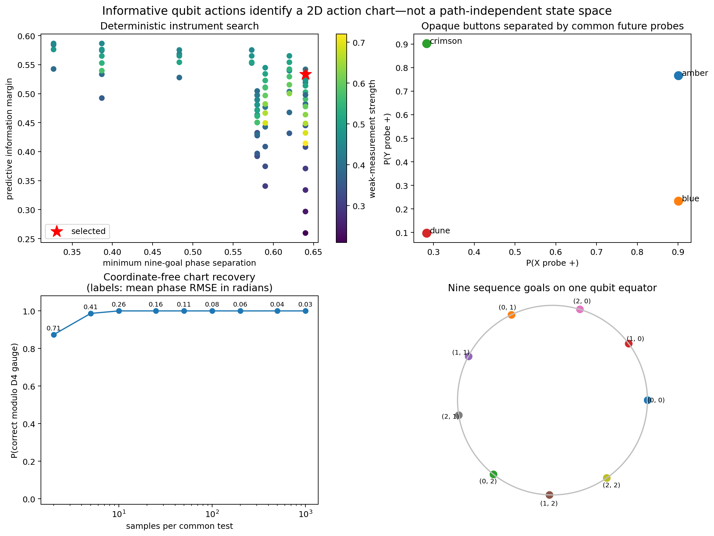
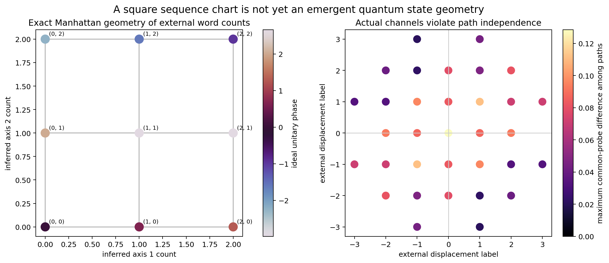

# Informative qubit actions: a learned action chart and a compositionality no-go

## Result in brief

A qubit is sufficient for an agent to discover the operational meaning of four
opaque actions without observing a hidden state label or being given action
coordinates. The selected actions are genuinely nonunitary instruments. Their
immediate outcomes and their effects on two common future probes identify two
inverse pairs and two independent directions, up to the unavoidable rotations
and reflections of a square. With only ten samples per common test, all 300
fixed-seed replications recover this action chart correctly.

But this does **not** produce an exact two-dimensional quantum state geometry.
Different action sequences assigned the same external lattice displacement
generally leave predictively different qubit states. Of the 41 displacement
classes generated by words of length at most four, 33 contain multiple paths;
none of those 33 are path independent to tolerance \(10^{-10}\). (The other
eight are singleton classes, so equivalence there is vacuous.) The worst
Euclidean difference between common-probe probability vectors is 0.1285. The exact \(3\times3\) Manhattan geometry is
therefore a geometry of action words or an external counter, not a geometry of
future-statistical equivalence classes of the actual nonunitary dynamics.

This negative result is scientifically useful. Identifiable directions are
necessary for emergent space but not sufficient. Their channels must also
compose into a sufficiently faithful, approximately path-independent
translation action.

## 1. Operational question

The learner is shown four buttons with arbitrary names:

```text
amber, blue, crimson, dune
```

It is not shown a qubit phase, lattice position, source label, cardinal
direction, or hidden transition table. It may reset the apparatus to one
operationally reproducible preparation, press a button, record its binary
outcome, and apply the same terminal \(X\), \(Y\), or \(Z\) probe after any
observed history.

The goal is first to infer whether the buttons possess a two-axis relational
structure. Only afterward do we audit the stronger claim that histories with
the same inferred displacement are operationally the same goal.

This separates three notions often collapsed in goal-geometry work:

1. **action identification:** distinguish the available interventions by
   observable consequences;
2. **action-chart reconstruction:** discover inverse pairs and independent
   generators, modulo an arbitrary coordinate gauge;
3. **state-space emergence:** show that words with the same chart displacement
   belong to one predictive equivalence class.

The construction succeeds at the first two and fails at the third.

## 2. Minimal nonunitary qubit instrument

Begin with

\[
 \rho_0=|+x\rangle\langle+x|.
\]

Button \(b\) has a phase \(\theta_b\) but the agent is not told it. It first
applies

\[
 U_{\theta_b}=e^{-i\theta_b Z/2},
\]

then makes the same weak \(X\) measurement. With strength \(0<s<1\), its
effects and Kraus operators are

\[
 E_o={I+osX\over2},\qquad
 K_{b,o}=\sqrt{E_o}\,U_{\theta_b},\qquad o\in\{+1,-1\}.
\]

Since \(\sum_o E_o=I\), each button is a valid trace-preserving instrument when
outcomes are ignored. Since \(E_o\) is not proportional to identity, the two
Kraus operators are not scalar multiples of unitaries: the action outcomes are
genuinely informative and their conditional effects genuinely disturb the
state.

The four hidden phases are \(\{+\alpha,-\alpha,+\beta,-\beta\}\). A deterministic
grid search over 11,799 triples \((\alpha,\beta,s)\) selected

\[
 \alpha=0.64,\qquad \beta=2.02,\qquad s=0.45,
\]

balancing five quantities: separation of nine finite-chart goal phases,
separation of the four button phases, absence of short approximate aliases,
immediate-outcome information, and signed future-probe information. The search
also penalizes disturbance and any bounded-horizon alias margin below 0.08.
The selected margins are:

| diagnostic | value |
|---|---:|
| minimum nine-goal phase separation | 0.6400 rad |
| minimum four-action phase separation | 1.2800 rad |
| shortest alias margin through length eight | 0.1000 rad |
| immediate outcome axis gap | 0.5564 |
| signed future-probe gap | 0.5333 |
| coherence retention \(\eta=\sqrt{1-s^2}\) | 0.8930 |

The optimization is a finite engineering search, not a proof of global
optimality. The construction and its operational inversion are analytic.

## 3. How action meaning is inferred

For reset state \(|+x\rangle\), the button's immediate plus probability is

\[
 P(o=+1\mid b)={1+s\cos\theta_b\over2}.
\]

Ignoring the weak-measurement outcome defines an \(X\)-dephasing channel. If
\(\eta=\sqrt{1-s^2}\), the post-action Bloch vector is

\[
 (\cos\theta_b,\;\eta\sin\theta_b,\;0).
\]

Consequently two common probes give

\[
 P(X{+}\mid b)={1+\cos\theta_b\over2},\qquad
 P(Y{+}\mid b)={1+\eta\sin\theta_b\over2}.
\]

The phase is reconstructed without a state label:

\[
 \widehat\theta_b=operatorname{atan2}
 \left({2\widehat P(Y{+}\mid b)-1\over\eta},
       2\widehat P(X{+}\mid b)-1\right).
\]

The agent then searches all assignments of the four opaque buttons to
\(\{\pm e_1,\pm e_2\}\), minimizing the failure of opposite phases to cancel.
No orientation is objectively privileged. Swapping axes and flipping either
axis produces the same inferred structure, so recovery is scored modulo the
dihedral \(D_4\) gauge.

Finite-sample recovery is:

| samples per signature component | chart recovery modulo \(D_4\) | mean phase RMSE |
|---:|---:|---:|
| 2 | 0.8733 | 0.7101 rad |
| 5 | 0.9867 | 0.4113 rad |
| 10 | 1.0000 | 0.2604 rad |
| 25 | 1.0000 | 0.1609 rad |
| 100 | 1.0000 | 0.0809 rad |
| 1000 | 1.0000 | 0.0261 rad |

Every entry contains 300 fixed-seed replications. The inferred coordinates are
not an input to the learner; hidden coordinates enter only in this audit.

## 4. Predictive-state reconstruction after histories

For an arbitrary observed button/outcome history \(h\), the three common probe
probabilities provide the Bloch vector

\[
 r_a(h)=2P(a{+}\mid h)-1,
 \qquad a\in\{X,Y,Z\},
\]

and hence the predictive density matrix

\[
 \rho(h)={I+r_X X+r_Y Y+r_Z Z\over2}.
\]

Thus the agent can reconstruct its operational state from future statistics,
without access to a simulator state label. Exact probabilities recover the
density matrix to numerical precision. Across 1,750 stochastic histories of
length zero through eight, using 300 Bernoulli samples for each probe gives
mean trace-distance error 0.0350.

This demonstrates a genuine predictive-state model. It does not yet show that
the predictive states form the inferred square chart.

## 5. Controls: what informativeness does and does not buy

### Random-unitary control

Replace each nonunitary instrument by its phase unitary and an independent fair
coin outcome. Immediate action outcomes then carry no information whatsoever.
Nevertheless the common \(X/Y\) future probes still identify all four phases:
at 200 trials the finite-control chart recovery is 100%.

This is an important correction to an overly strong intuition. **Informative
immediate outcomes are not necessary for action identifiability when actions
have distinguishable future effects.** The nonunitary construction shows that
outcomes can be intrinsically informative; the random-unitary control shows
that future statistics alone can suffice.

### Null-observation control

All buttons return fair coins and leave \(|+x\rangle\) unchanged. Neither
immediate outcomes nor future probes distinguish them. At 200 trials the rate
of identifiable and correct charts is zero under the preregistered minimum
signature-distance threshold 0.15. This excludes recovery from arbitrary
button names or the chart-assignment routine alone.

### External-counter control

An external program can assign the four buttons to cardinal increments and
count them, even while the qubit is null. It then creates an exact Manhattan
goal chart. But this geometry lives wholly in a classical counter supplied by
the experimenter. The control proves that exact sequence geometry by itself is
not evidence for emergent quantum geometry.

## 6. Sequence goals and the exact external chart

Once two inverse pairs have been inferred, bounded-horizon sequence goals can
be defined by their signed button counts. Nine targets
\((i,j)\in\{0,1,2\}^2\) have shortest word costs

\[
 d_{\rm word}((i,j),(k,l))=|i-k|+|j-l|.
\]

This is exactly a nontrivial \(3\times3\) square hodological chart and all 81
pairwise costs in `goal_geometry.csv` agree with Manhattan distance. The goals
are more elaborate than basis states: they are bounded languages of action
histories.

However, signed word count is an external equivalence relation unless actual
quantum future statistics respect it. That is the decisive next audit.

## 7. Predictive compositionality fails

For each word \(w\) of length at most four, apply the actual nonselective
channels to \(\rho_0\) and record the informationally complete common-probe
signature

\[
 \sigma(w)=\big(P(X{+}\mid w),P(Y{+}\mid w),P(Z{+}\mid w)\big).
\]

Group words by the displacement assigned by their inferred signed counts. If
the square were an emergent quantum state space, every group would satisfy

\[
 \sigma(w)=\sigma(w')\quad\text{whenever}\quad
 \Delta(w)=\Delta(w').
\]

It does not. All 33 tested classes containing multiple paths violate equality
at \(10^{-10}\); the remaining 8 of 41 total classes contain only one word.
The worst within-class signature difference is 0.1285.
Since \(X,Y,Z\) probes are tomographically complete, unequal signatures mean
unequal density matrices, not a weakness of the test set.

The analytic cause is noncommutativity at the channel level. Each action has
the form

\[
 \Phi_\theta=D_X\circ R_Z(\theta).
\]

Although the phase rotations commute, \(D_X\) does not commute with a
nontrivial \(Z\) rotation. In general,

\[
 \Phi_\alpha\Phi_\beta\ne\Phi_\beta\Phi_\alpha.
\]

Moreover, even a dephasing choice that commuted with the rotations would make
paths with cancellating detours lose more coherence than shortest paths. Exact
equivalence of all same-displacement histories therefore requires either no
disturbance, a protected/error-corrected representation, restriction to a
canonical/geodesic word language, or additional memory retaining the covering
space coordinate.

Conditional outcomes make history dependence still richer; the nonselective
failure already suffices to reject path independence.





The first figure shows that opaque action meanings are robustly recoverable.
The second contrasts the exact externally counted lattice with the observed
failure of different paths to become one predictive quantum goal.

## 8. What the minimal example establishes

Established:

- a qubit supports four genuinely nonunitary informative instruments;
- observable common future tests reconstruct their signed phase effects;
- inverse pairs and two axes are recoverable without hidden state/action
  coordinates, modulo the correct \(D_4\) gauge;
- arbitrary conditional histories admit coordinate-free predictive-state
  tomography;
- bounded sequence goals carry an exact square Manhattan word geometry;
- random-unitary future effects are sufficient for action meaning, whereas
  null actions are not.

Not established—and positively falsified for this model:

- same-displacement words are not predictive equivalence classes;
- the exact Manhattan labels are not encoded solely in instantaneous qubit
  state;
- informative measurement outcomes do not by themselves make channel
  composition spatial;
- the finite chart is not an exact emergent 2D quantum state geometry.

The proper name for the result is therefore an **operationally learned
two-dimensional action chart with a compositionality no-go**, not an emergent
two-dimensional qubit space.

## 9. Necessary condition suggested by the failure

Let \(\mathcal A^*\) be action histories and let \(\sim_\Delta\) identify words
assigned the same proposed displacement. Let \(\sim_P\) be predictive
equivalence: two histories are equivalent when every allowed future experiment
has the same distribution. A proposed spatial chart is genuinely represented
by the agent's predictive state only if

\[
 w\sim_\Delta w'\quad\Longrightarrow\quad w\sim_P w'.
\]

For exact translation space one additionally wants the induced quotient action
to be faithful over the operative patch and the minimal intervention costs to
match the desired norm. The current work isolates the first implication as a
testable necessary condition. It should be added alongside metric stress and
success rate in future experiments; those aggregate diagnostics can look
spatial while hiding path-dependent internal states.

A promising next construction is an encoded subsystem in which informative
syndrome outcomes reveal action semantics while a protected logical phase
carries commuting translations. That likely requires dimension larger than
two, repeated error correction, or explicit fiber structure: the syndrome can
be internal/fiber state while the equivalence class of logical translations is
the spatial base.

## 10. Reproducibility

From this directory run:

```bash
python -m unittest discover -s tests -v
MPLBACKEND=Agg python run_qubit_experiment.py
```

Seven tests verify Kraus completeness and nonunitarity, state-dependent
outcomes, coordinate-free chart inference, exact predictive tomography,
Manhattan sequence costs, deterministic search margins, and the expected
failure of predictive path independence.

Artifacts:

- `results/search_top.csv`: best 100 of 11,799 deterministic candidates;
- `results/exact_predictive_signatures.csv`: informative, random-unitary, and
  null action signatures;
- `results/chart_recovery.csv`: 2,700 finite-sample chart reconstructions;
- `results/predictive_state_reconstruction.csv`: tomography after stochastic
  histories;
- `results/controls.csv` and `results/finite_control_recovery.csv`: structural
  and sampled control results;
- `results/goal_geometry.csv`: all 81 external sequence-goal costs;
- `results/word_equivalence_audit.csv`: common-probe path-independence test;
- `results/summary.json`: headline values and configuration;
- `results/figures/`: two publication-sized visual summaries.

The only stochastic studies use NumPy seed 20260812. No learner receives a
hidden state or coordinate label.
